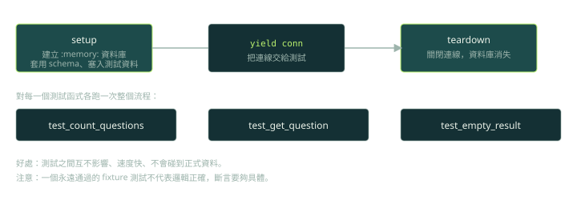

第 8 章把 AI 用在測試上，作者認為這可能是這些工具最划算的用途。這一篇整理他的做法，並補上一個書裡沒有深談的風險：**測試本身也可能是錯的**。

## 作者為什麼看好 AI 寫測試（p.211–212）

- 單元測試通常只需要單一函式或方法的 context，比產品程式碼單純。
- 測試有大量重複的樣板與設定，這正是 AI 擅長的部分。
- 偏見與授權疑慮的影響相對小。
- 它常能提出你沒想到的測試案例，拓寬覆蓋。

## 實作觀察

1. **預設框架不一定是你要的**（p.213–217）：作者試的三個工具預設都傾向產出 `unittest`，要明確說「用 pytest」才會改。
2. **直接下 `/tests` 這類快捷指令，結果可能完全不能用**（p.216–218）：產生的測試對類別的用法做了錯誤假設，叫用不存在的方法。補上更明確的 prompt 之後才有改善。
3. **用對話一步步建立測試基礎設施**（p.219–229）：先要一個記憶體內的測試資料庫，再改成 fixture，再寫真正有斷言的測試。

作者整理的 prompt 檢查清單（p.230）：指定測試框架、提供檔案路徑、說明資料庫需求（記憶體內或 mock）、描述想測的邊界案例、指定斷言風格、說明依賴、說明 fixture 要重用還是新建；先從概括開始，再用後續提問細化。

## fixture 長什麼樣子

書中的例子是用 pytest fixture 提供乾淨的記憶體內資料庫（以下是依這個概念寫的示意，不是書中原始碼）：



```python
import sqlite3
import pytest

@pytest.fixture
def db():
    conn = sqlite3.connect(":memory:")        # setup：每個測試各一份
    conn.executescript(SCHEMA_SQL)            # 套用 schema
    conn.executemany("INSERT INTO questions(text, answer) VALUES (?, ?)", SEED_ROWS)
    yield conn                                # 把連線交給測試
    conn.close()                              # teardown：資料庫隨之消失

def test_all_seed_questions_loaded(db):
    (count,) = db.execute("SELECT COUNT(*) FROM questions").fetchone()
    assert count == len(SEED_ROWS)            # 具體的期望值，而不是「查得到就好」
```

## 書中自己踩到的弱測試

作者第一版的「連線測試」其實什麼都沒驗證，只確認查詢沒有報錯；後來改成比對題庫的預期筆數才有意義（p.226–227）。另外，隨機抽題的函式只能驗證「回傳了一個清單」，無法驗證內容。這兩個都是**斷言太弱**的例子。

```python
# 弱：幾乎什麼都測不出來
assert result is not None
assert len(result) > 0

# 強：寫出具體的期望，並且能被破壞程式的行為打破
assert [q.id for q in result] == [3, 7, 12]
assert len({q.id for q in result}) == len(result)    # 不得重複
```

## 進階觀點

- **同一個模型寫程式又寫測試，錯誤會相關。** 它對需求的誤解會同時出現在兩邊，測試因此可能把 bug「固定」下來，全部變綠但結果是錯的。
- **斷言強度要被檢查。** 方法：突變測試（mutation testing）、手動破壞程式看測試是否變紅、對照覆蓋率但不迷信它。
- **agent 的規則：不得為了讓測試通過而修改測試。** 測試的修改要獨立 review，必要時用權限讓 agent 對測試目錄唯讀。
- **隨機行為要可注入。** 隨機抽題這類程式，應該能注入 seed 或可替換的隨機來源，否則只能測「長度」。

## 檢查點

Q: 助手為你的函式產生了 12 個測試，全部通過，但多數斷言是 `assert result is not None`。最合理的下一步是？
- [ ] 通過就代表函式正確，直接合併
- [ ] 要求助手再產生 50 個同類型的測試
- [x] 檢查斷言強度：對關鍵行為加入具體的期望值，並用突變測試或手動破壞程式，確認測試真的會失敗
- [ ] 刪除這些測試，因為 AI 寫的測試一律不可信
解釋: 全綠不等於有保護力。弱斷言能通過，也能在程式壞掉時依然通過。要證明測試有用，就要證明它在程式被破壞時會失敗。

## 思考練習

Q: 讓 agent 既寫程式又寫測試，你如何避免它「自己騙自己」？
- 先講風險：同一個模型的誤解會同時出現在程式與測試，測試可能固定住錯誤行為。
- 讓測試先行：由人或獨立的流程寫驗收測試，agent 只能讓它們通過，不能修改它們。
- 檢查測試品質：突變測試、手動破壞抽查、斷言強度的 review 清單。
- 權限與流程：測試目錄對 agent 唯讀，或測試的變更需要額外核准；CI 單獨保存測試基準。
- 用 eval 量化：記錄「agent 修改測試」的比例，作為紅旗指標。
