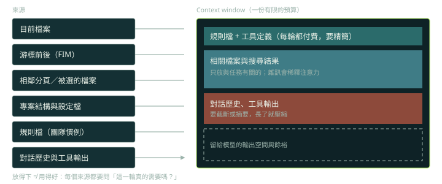

## 助手使用的 context 來源（p.35–36）

書中列出 IDE 型助手會蒐集的資料：

- 目前編輯的檔案。
- 相鄰分頁的內容。
- 整個工作區或解決方案的結構。
- 游標前後的程式碼（fill-in-the-middle，簡稱 FIM：不只看你寫到哪裡，也看後面已經有什麼）。

專案層級的理解則來自 repo 層級的資訊、PR 與 issue、文件與設定檔。作者提到企業版通常比個人版看得更深。

重點是：助手看起來「懂你要做什麼」，不是魔法，而是**有東西被放進 context**。放進去的東西不對，建議就會不對。



## 七個常用的對話模式（p.35）

書中整理了一組可以反覆使用的提問方式，它們的共同點是把「意圖」講得明確：

1. 找出選取程式碼中的錯誤。
2. 重構以提升品質（可指定針對安全、速度或資源）。
3. 針對特定任務產生程式碼（連資料庫、讀檔、送 HTTP 這類樣板）。
4. 解釋這段程式碼怎麼運作（讀舊程式或別人的程式時特別有用）。
5. 為這段程式碼補測試。
6. 提出可讀性與可維護性的改進。
7. 比較兩個方案的取捨。

## 為什麼不把整個專案都放進 context（p.293）

第 10 章談到 Cursor 時，作者回答了一個常見疑問：為什麼要自己挑選要加入的檔案，而不是全部放進去？答案是雜訊會稀釋模型的注意力，讓回應變慢、也比較不準。這和本課程第 1 章「context 是預算」的結論一致。

## 規則檔：把團隊慣例變成 context（p.288）

書中提到 Cursor 支援專案層級的規則檔（`.cursorrules`），讓團隊把編碼標準直接寫進 AI 的行為裡，減少 review 時間。

## 進階觀點

- 各家工具的規則檔本質相同：**一份每次都會被載入的專案說明**（Claude Code 的 CLAUDE.md、其他工具的 AGENTS.md 之類）。
- 該放什麼：建置與測試指令、架構約定、禁區（不要動的目錄）、風格與命名慣例、常見陷阱。
- 不該放什麼：很快過期的細節、整份 API 文件、長篇背景故事。它每一輪都在付費，越短越好。

一份給 C++ monorepo 用的規則檔大概長這樣（示意）：

```markdown
# AGENTS.md
## 建置與測試
- 建置單一模組：`bazel build //net/rpc:all`
- 只跑相關測試：`bazel test //net/rpc:client_test`
## 約定
- C++17；用 `absl::Status` 回報錯誤，不要丟例外。
- 新的公開 API 必須附 `*_test.cc`。
## 禁區
- 不要修改 `third_party/` 與 `generated/`。
```

- 要像程式碼一樣維護：放進版本控制、有 owner、改動要 review。規則檔過期造成的錯誤很難除錯，因為看起來像「模型變笨了」。

## 檢查點

Q: 助手產生的程式碼呼叫了專案裡根本不存在的 helper 函式。最可能的 context 問題與最佳處理是什麼？
- [ ] 模型壞了，換更大的模型就會好
- [ ] temperature 太高，改成 0 就不會再發生
- [x] 定義該 helper 的檔案沒有進入 context（或被雜訊稀釋）；應只加入相關檔案，並在規則檔寫明共用工具函式的位置
- [ ] 把整個 repo 都貼進去
解釋: 呼叫不存在的函式，多半是它看不到真正的定義。精準加入相關檔案，加上規則檔指路，比全塞進去有效；全塞進去反而可能稀釋重點。

## 思考練習

Q: 一個 500 萬行的 C++ monorepo，你會怎麼讓 agent 找到正確的程式碼並遵守團隊慣例？
- 分層的規則檔：根目錄放通用的建置與風格規範，子目錄放各模組自己的約定，讓 agent 只在相關目錄載入需要的部分。
- 不依賴一次塞滿：提供搜尋工具（ripgrep、符號索引、LSP），讓 agent 按需讀檔，並限制單次讀取量。
- 把「怎麼建置、怎麼測試單一模組」寫成可執行的指令，讓 agent 能自己驗證。
- 用 eval 驗證策略：同一組任務比較不同的 context 策略，量化成功率與成本。
