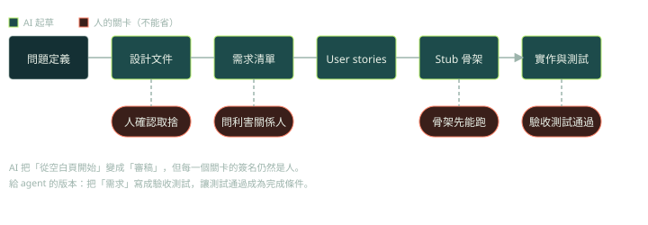

第 3、4 章用一個「業餘無線電執照模擬考網站」當範例，示範怎麼在寫程式之前，先用 AI 把設計與需求弄清楚。

## 先問「要解決什麼問題」（p.58–59）

作者強調的第一步不是開 IDE，而是問：到底要解決什麼問題？再用 AI 幫你找盲點，書中建議的提問方式例如：

- 這類應用常見的邊界情況有哪些？
- 這個領域有哪些法規考量？
- 這類應用通常重視哪些非功能需求？

## 角色提示的組成（p.59–60）

書中把一個起手式 prompt 拆成五個部分：**角色**（例如軟體設計專家）、**任務**、**背景資訊**、**指示**、**結尾**（指定輸出格式）。也建議把角色寫得更具體（例如「有十五年可擴展系統經驗的架構師」）。套用到書中的案例，大概是這樣：

```text
你是一位有十五年經驗的軟體架構師。                  # 角色
任務：幫我拆解下面的問題，找出盲點。                # 任務
背景：Python 網站，要從題庫隨機抽 35 題做模擬考。   # 背景
指示：列出邊界情況、非功能需求與可能的陷阱。        # 指示
輸出：編號清單，每項附一行理由。                    # 結尾（格式）
```

## 流程：設計文件 → 需求 → user stories → stub（p.61–85）



1. 讓 AI 產出一份設計文件的初稿。書的主張是：最大的好處是不用從空白頁開始，工作從「創作」變成「審稿」。作者說團隊的設計會議時間可以大幅減少（p.61），這是他的經驗，不是實驗結果。
2. 從設計文件擷取需求，再整理成 user stories。
3. **Stubbing**（p.78–81）：先建立應用的骨架，用簡化的替身函式代替真正的實作。要點：
   - 用 TODO 標明每個 stub 的意圖。
   - 骨架要先能跑，再加功能。
   - 遵守 YAGNI：不要為還不需要的功能建 stub。
   好處是早期整合、早期發現不相容，以及更快迭代。

下面是 stub 的樣子（書中用 Python，這裡換成 C++ 示意，原則相同）：

```cpp
// 介面先定下來，實作之後再補；骨架要先能編譯、能跑
class QuestionSelector {
 public:
  // TODO(req 2.1): 從題庫隨機抽 n 題，同一場不得重複
  std::vector<Question> Select(int n) {
    return {};  // stub：先回空，讓呼叫端與測試可以先寫
  }
};
```

## 交叉比對兩個模型（p.83–84）

作者讓 ChatGPT 與 Gemini 各自從同一份設計文件擷取需求，結果有時很像、有時差很多。他的建議是兩種情況都不要意外，並且把結果帶回利害關係人驗證。

## 進階觀點

- **兩個模型一致，不等於正確。** 它們可能共享類似的訓練偏差，一致只代表「常見」。交叉比對能找到遺漏，不能證明正確。
- **真正的驗證是回到人，以及轉成可執行的驗收條件。** 書中也提醒要和利害關係人確認。
- **對 agent 最可靠的工作流之一**：先寫規格與驗收測試，再讓 agent 實作，以測試通過作為完成條件。stub 在這裡的角色，是先把介面定下來，讓測試可以先寫。
- 設計文件由 AI 起草沒問題，但**決策與取捨要由人簽名**：技術選型的理由應該寫在文件裡，之後才有辦法被檢討。

## 檢查點

Q: 兩個不同的模型對同一份設計文件擷取出幾乎相同的需求清單。這能證明需求是正確的嗎？
- [ ] 能，兩個獨立來源一致就可以視為正確
- [ ] 能，因為這些模型都經過安全訓練
- [x] 不能。模型可能共享類似的訓練偏差，一致只代表「常見」；仍須向利害關係人確認，並把需求轉成可執行的驗收條件
- [ ] 不能，因為模型無法閱讀設計文件
解釋: 交叉比對是便宜的覆核，能抓到單一模型的遺漏，但無法取代對真實需求的確認。把需求寫成可執行的測試，才是可以重複驗證的證據。

## 思考練習

Q: 描述你會怎麼讓 agent 實作一個中型功能，從規格到驗收。
- 先和人一起把需求寫清楚，並轉成驗收測試（含邊界情況），測試先紅。
- 定義介面與 stub，讓 agent 在明確的範圍內工作；限制可以修改的目錄。
- 讓 agent 以測試為回饋迴圈自己迭代，設定最大步數與成本上限。
- 人在關鍵點介入：架構決策、測試本身的修改、合併前的 diff review。
- 記錄每一次人工介入的原因，之後可以變成規則檔或 eval 案例。
