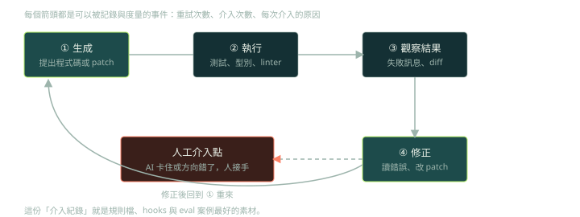

第 5、6 章（以及第 8 章的測試部分）記錄了作者用 Blackbox AI 與 Tabnine 從頭做出一個應用的過程，其中最有價值的不是成功的部分，而是他**每次必須人工介入的地方**。這些可以直接當成失敗模式的案例庫。

## 案例與分類



1. **只走 happy path**（第 5 章）：AI 產生的程式在理想情況可以跑，但缺少錯誤處理與強化。作者建議重構時優先補強這部分。
2. **對你的程式做了不存在的假設**（第 8 章，p.217–218）：助手為某個類別產生的測試，假設了建構子與方法的用法和實際不符，呼叫了專案裡不存在的方法，測試根本跑不起來。
3. **看起來對，但沒解決真正的問題**（第 6 章）：資料庫的遞增 ID 出現衝突，助手照字面產生了「只能用一次」的新 ID；之後又建議了該資料庫不支援的寫法。作者靠對 SQLite 自動遞增行為的了解自己介入，才找到正確做法。
4. **狀態與生命週期錯誤**（第 5 章）：重構後多個方法各自建立連線與 cursor，執行時出現 TypeError，改為共用同一個 cursor 才解決。
5. **邊界條件**（第 8 章，p.222–223）：把資料庫複製到記憶體時，沒有排除內部的系統資料表，導致錯誤，要再調整查詢。

## 兩個案例的程式碼對照

「幻覺的方法」在程式碼裡長這樣，防線是先讀真實定義、再實際執行：

```python
# AI 產生的測試（示意）：呼叫了專案裡並不存在的方法
assert question.check_answer("Paris") == True

# 防線：先查真實定義，再跑測試
#   $ rg "def check_answer|class Question" src/
#   $ pytest -x tests/test_questions.py
```

資料庫 ID 的例子，比較穩的做法是讓資料庫自己產生（SQL 為示意，非書中原始碼）：

```sql
CREATE TABLE question_sets (
    question_set_id INTEGER PRIMARY KEY AUTOINCREMENT,
    session_id      INTEGER NOT NULL,
    question_id     INTEGER NOT NULL
);
-- 給 NULL，SQLite 會自動配發下一個 ID；每一筆都成立，不只第一筆
INSERT INTO question_sets (question_set_id, session_id, question_id)
VALUES (NULL, 6, 17);
```

## 作者歸納的檢查清單

- 審查 SQL：避免 `SELECT *`、檢查 WHERE 條件、留意索引、考慮交易、確認錯誤處理。
- 每接受一個建議就驗證功能。
- 測邊界情況，不只 happy path。
- 實際檢查資料庫的狀態。
- 留意相關功能是否出現副作用。
- 當 AI 不理解全貌時，準備好手動接管。

## 進階觀點：把案例變成分類法與防線

把上面的案例抽象成失敗模式分類，每一類配一個可自動化的防線，就是 eval 與 harness 設計的起點：

| 失敗模式 | 例子 | 防線 |
|---|---|---|
| 幻覺的 API 或簽名 | 呼叫不存在的方法 | 讓 agent 讀真實定義、型別檢查、LSP |
| 對平台特性的錯誤假設 | 不支援的 SQL 寫法 | 實際執行並觀察、在目標環境跑測試 |
| 狀態與生命週期 | 連線、cursor 重複建立 | 整合測試、資源管理的慣例寫進規則檔 |
| 邊界條件 | 系統資料表、空輸入 | 要求列出邊界案例並寫成測試 |
| 只走 happy path | 缺少錯誤處理 | review 清單、故障注入測試 |
| 需求誤解 | 照字面做，沒解決問題 | 驗收測試先於實作 |

另外，作者每次「人工介入」的時機與原因，正是第 2 週作業要你記錄的東西：它們會變成規則檔的一行、一個 hook，或 eval 裡的一個案例。

## 檢查點

Q: 助手為你的類別產生的單元測試，呼叫了專案中並不存在的方法。這屬於哪類失敗，哪個防線最直接？
- [ ] 取樣的隨機性；把 temperature 設成 0
- [x] 幻覺的 API 或錯誤假設；讓 agent 先讀取真實的定義，並實際執行測試，用型別檢查或 LSP 提早發現
- [ ] 訓練資料過時；等下一版模型
- [ ] context window 太小；換更大的 window
解釋: 這是模型對你的程式做了錯誤假設。降低 temperature 不能讓它看到真實定義；最直接的做法是讓它讀到真實簽名，並用執行結果（測試失敗、型別錯誤）當回饋。

## 思考練習

Q: 設計一個針對 coding agent 的失敗模式分類，並說明每一類你會怎麼偵測與防止。
- 從真實紀錄出發：蒐集 agent 失敗的案例，人工標註成因，而不是憑空列類別。
- 至少區分：幻覺的 API、平台特性假設、狀態與生命週期、邊界條件、happy path only、需求誤解。
- 每一類對應一個自動化的偵測：型別檢查、測試、執行觀察、diff 範圍檢查。
- 用頻率與嚴重度排序，優先處理最常見且代價最高的類別，並用 eval 追蹤改進。
