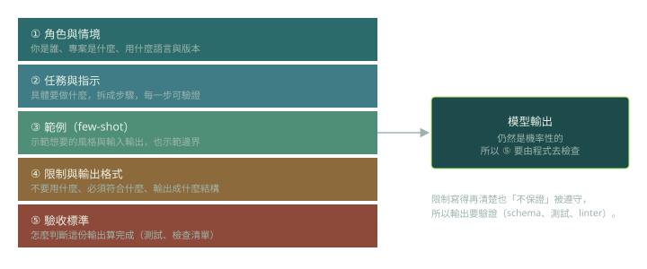

第 9 章前半是 prompt engineering 的基本功。對有經驗的工程師來說，最好的理解方式是把它當成「寫需求」：越具體、越能被驗證，結果越穩。

## 一個 prompt 的組成（p.247–254）

書中用同一個除錯情境對比兩種寫法。含糊的版本只有「修好這段程式」。好的版本則附上背景、實際的錯誤訊息與程式碼，並且列出要的產出：找出 bug、說明原因、給出加上輸入驗證的版本、補上範例測試。

```text
# 含糊
修好這段程式。

# 具體
我在除錯一個計算折扣的 Python 函式。傳入負值時會丟出
ValueError: Discount cannot be negative。程式碼如下：<code>

請依序：1) 指出 bug  2) 說明為什麼會發生
       3) 提供加入輸入驗證的版本  4) 附上測試案例
```



作者歸納的三個要素是：**情境**（背景、限制、技術需求）、**指示**（簡單直接、拆成步驟）、**範例**（示範想要的輸入輸出格式與邊界）。

## 六種基本類型（p.257–264）

| 類型 | 做法 | 適合 |
|---|---|---|
| zero-shot | 不給範例，直接要求 | 簡單、常見的任務 |
| few-shot | 先給幾個範例再提問 | 要固定風格或格式 |
| open-ended | 開放式問題 | 找想法、討論取捨 |
| constrained | 限定範圍與條件 | 已知要什麼、要精準 |
| structured | 指定章節或格式 | 文件、報告 |
| iterative | 對話式反覆修正 | 一開始講不清楚時 |

few-shot 的例子：先貼兩個符合你風格的函式，再要求第三個。它同時傳達了「命名、長度、註解風格」，這比用文字描述更有效。

```python
# few-shot：用範例固定風格
def add(a: int, b: int) -> int:
    """回傳兩數之和。"""
    return a + b

def clamp(x: int, lo: int, hi: int) -> int:
    """把 x 限制在 [lo, hi]。"""
    return max(lo, min(x, hi))

# 請照上面的風格，寫一個計算階乘的函式。
```

作者也強調一件重要的事：**constrained 與 structured prompt 都不保證模型會照做**，因為輸出仍然是機率性的。

## Meta-prompting 與書中的算術例子

作者建議：讓模型先對你的 prompt 提出澄清問題，再幫你改寫（p.254–257）。他宣稱這在「超過 90%」的情況下會得到更好的 prompt，但沒有附上實驗，這應當視為經驗談。

另一個例子是計算 234 × 432（p.261–263）。直接問答案不對，改成「用三種方法計算並展示過程」後得到正確的 101,088。但作者自己也說，同樣的 prompt 重跑幾次仍會出現錯誤答案，因為 LLM 並不是為了計算而設計的。

## 進階觀點

- **Prompt 是程式碼。** 要版本控制、要 review、要有 eval 來比較兩個版本是否真的有差。
- **「展示推導過程」的效果要自己量。** 對某些任務有幫助；對現代已具備推理能力的模型，是否還需要明說，取決於模型與任務，用 eval 決定，而不是迷信。
- **精確計算交給工具。** 算術、日期、單位換算、大量資料處理，這些該用程式執行，這也是 tool use 存在的動機。
- **限制「不保證遵守」是設計約束**：所以重要的格式要用結構化輸出加 schema 驗證，不要只靠 prompt 裡的一句話。

## 檢查點

Q: 針對 234 × 432，反覆提示「請一步一步算」仍然偶爾出錯。工程上最穩的處理方式是？
- [ ] 把 temperature 調到最高，讓模型多樣化
- [ ] 加上角色扮演，例如「你是數學教授」
- [x] 提供計算工具（例如執行程式碼），讓模型呼叫工具取得精確結果，並驗證工具的輸出
- [ ] 把 prompt 寫得更長
解釋: 精確計算不是 prompt 的問題。把它交給確定性的工具，模型只負責決定要算什麼、怎麼使用結果，可靠性才會從「看運氣」變成「可驗證」。

## 思考練習

Q: 你如何證明某次 prompt 修改「真的」比較好，而不是剛好這次運氣好？
- 先建立一組代表性的任務與可自動判斷的評分方式（測試通過、格式正確、人工標註）。
- 新舊 prompt 在同一組任務上各跑多次，報告通過率與信賴區間，而不是單次結果。
- 同時看成本與延遲，因為更長的 prompt 可能提高成本。
- 看失敗案例的分類，確認改進的是你想改的失敗模式，沒有引入新的退步。
- 把 prompt 改動走正式的 review 與版本控制，保留紀錄。
