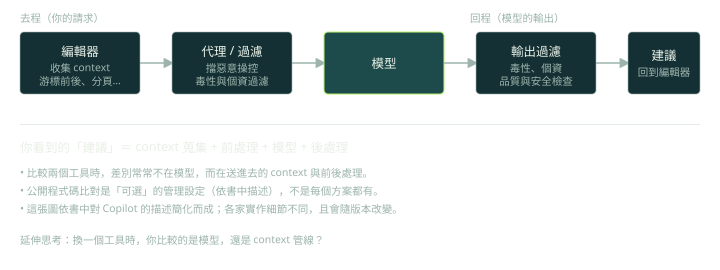

## 兩大類工具（p.6–8）

書中把工具分成兩種：

- **整合在 IDE 裡的工具**（如 Copilot、Tabnine、Blackbox）：直接看到你的程式碼當 context，適合在寫程式時使用。
- **獨立的聊天介面**（如 ChatGPT、Gemini、Copilot Chat）：通用對話，作者的經驗是比較適合抽象層面的工作，例如設計與討論。

這個分類現在已經模糊，因為許多 IDE 工具有聊天視窗，聊天產品也有 agent 模式。要記的不是產品名，而是**差異來自哪裡：context 怎麼取得、能不能直接改檔、能不能執行指令**。

## 補全與生成的差別（p.15–17）

傳統程式碼補全依賴語言規則與已知的符號；生成式工具依靠從大量程式碼學到的模式，能根據註解或需求產生整段實作，範圍可以涵蓋整個檔案與專案。

## 一次請求在 Copilot 裡經過什麼（p.28–31）

書中描述的管線可以當作「工具不等於模型」的例子：

1. 編輯器收集 context：游標前後的程式碼（fill-in-the-middle）、開啟的分頁、檔名與類型、專案結構、語言與框架。
2. 送到代理伺服器：先過濾惡意操控的企圖，再做毒性與個資過濾。
3. 模型產生建議。
4. 回程再過濾，並檢查品質、安全，以及（可選）是否與公開程式碼過於相似。



啟示：你看到的建議，是 **context 蒐集 + 前處理 + 模型 + 後處理** 的總和。比較兩個工具時，差別常常不在模型，而在 context 與管線。

## 導入時要考慮的事（p.22–24）

- 資料品質與授權：訓練資料來源與產出和原始碼過於相似時的法律問題（作者自己也說這仍有爭議）。
- 和既有工作流整合：與 IDE 設定、個人風格的一致性。
- 團隊層面：約定如何標記 AI 輔助的程式碼、和 code review 的關係、專有程式碼送進工具的安全顧慮、全員的使用權限一致。
- 品質保證：AI 產生的程式碼要符合與人寫的相同標準，使用情況要透明。
- 工具更新很快，要分辨哪些是趨勢、哪些真的有用。

## 進階觀點

- **產品名會過期，評估維度不會**。建議用這些維度比較工具：
  1. context 取得方式（手動貼上、當前檔案、整個 repo、agent 自行搜尋）
  2. 自主程度（補全、聊天、agent）
  3. 修改機制（diff 預覽、直接寫檔、能否執行指令）
  4. 資料與合規（程式碼是否離開公司、保留政策）
  5. 可客製（規則檔、MCP、hooks）
  6. 成本結構
  7. 可量測性（有沒有日誌與指標）
- **導入 AI 工具真正費工的地方，不是挑一個工具，而是建立證據**：定義基線指標、做有對照的試行、累積失敗案例庫，再決定擴大或停止。

評估表可以很簡單，重點是「每個分數都附證據」：

```yaml
# 工具評估表（示意）：每個維度 1–5 分，並附證據連結
tool: <name>
context_acquisition: 4   # 能自己搜尋 repo？還是只能看開啟的檔案？
autonomy: 3              # 補全 / 聊天 / agent
edit_mechanism: 4        # diff 預覽、能否執行指令
data_compliance: 5       # 程式碼是否離開公司、保留政策
customization: 4         # 規則檔、MCP、hooks
cost_per_task: 3
measurability: 2         # 有沒有日誌與指標可查
evidence: ["tasks/refactor-01.md", "tasks/bugfix-07.md"]
```

## 檢查點

Q: 你要為 200 人的工程組織評估 AI coding 工具。哪個做法最成熟？
- [ ] 選市佔率最高的產品，全公司開通
- [ ] 讓每位工程師各自決定，不收集任何資料
- [x] 先定義評估維度與任務集（含資料合規），在代表性的 repo 上讓各工具做同一組任務，記錄結果與失敗案例，再決定
- [ ] 以官網 demo 的表現為準
解釋: 工具變化很快，demo 不代表你的 codebase。有可比較的任務集、有資料合規的檢查、有失敗案例的紀錄，才能做出可以被挑戰、也可以被修正的決策。

## 思考練習

Q: 你被請去決定公司要不要導入某個 AI coding 工具，你會怎麼做？
- 先釐清目標與風險：要提升什麼（速度、品質、上手時間），哪些程式碼不能離開公司。
- 定義評估維度與一組代表性任務，同一組任務跑每個候選工具。
- 蒐集量化與質化資料：完成率、需要人工介入的次數、review 發現的問題、開發者回饋。
- 試行後給出建議與停損條件，並規劃使用慣例（標記 AI 輔助、review 要求、權限設定）。
