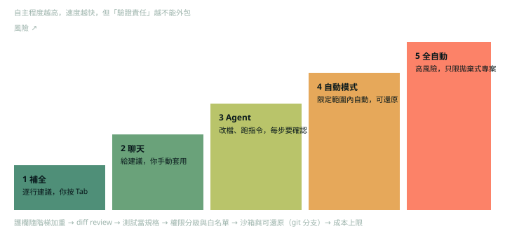

第 10 章用 Cursor 示範「vibe coding」：用自然語言引導 AI 產生整個專案。這一篇整理書中的要點，並補上對 agent 工具最重要的問題：**自主程度與風險怎麼配**。

## 什麼是 vibe coding（p.286–287）

書中的定義是：使用者用簡單的語言提示讓 LLM 寫程式，人的角色從手寫程式變成引導與驗收。作者提到這個詞由 Andrej Karpathy 在 2025 年 2 月提出，他形容的狀態大致是「看到、說出、執行、複製貼上，而且多半能跑」。

書中認為適合的情境：

- **快速原型**：週末內做出可以給利害關係人看的 demo，之後再用自己的方式做「真正的版本」。
- **不熟悉的技術**：先讓工具做出一個原型來看看可能性。
- **不重要的東西**：內部小工具、與朋友玩的遊戲。

作者也明確警告：處理敏感資料或企業級的正式軟體，不要這樣做就直接上線，因為 LLM 不能被問責（p.287）。

## Cursor 的特點（p.287–295）

- **Agent 模式**：AI 可以自己探索 codebase、讀文件、修改多個檔案、執行終端指令，使用者負責監督與核准。
- **專案層級 context 與規則檔**：把團隊標準寫進規則檔。
- **三種模式**：Agent、Ask、Manual。
- **挑選 context**：不是整個專案都丟進去，雜訊會稀釋焦點（呼應 context 預算的觀念）。
- **模型與費用**：較新或推理型的模型通常較貴；MAX 模式會把 context 拉到最大，書中提醒帳單可能因此暴增。

## 書中的流程（p.288–298）

作者先想清楚遊戲的概念，再寫了一份很詳細的首輪 prompt（指定語言、框架、規則、操作、程式碼品質要求）。他的經驗是：**初始 prompt 越完整，後面來回越少**。第一次產出就能直接執行，之後用回饋修正問題（例如木頭互相重疊）。作者也提到，專案變大後，工具大約能把你帶到八成，剩下需要手動處理（p.288），這是他的經驗，不是量測結果。

## 進階觀點：自主程度與護欄



vibe coding 與工程化地使用 agent，差別不在工具，而在**誰負責驗證**。護欄要隨自主程度加重。下面是一份「依風險分級」的政策示意（格式與欄位是示意，不是任何特定工具的設定）：

```yaml
autonomy_policy:
  prototype_sandbox:           # 拋棄式專案、無敏感資料、可還原
    mode: auto
    guardrails: [git_branch, test_gate, cost_cap_usd: 5]
  internal_service:            # 有使用者，但可回滾
    mode: confirm_each_command
    guardrails: [diff_review, tests_required, directory_allowlist]
  regulated_or_irreversible:   # 金流、權限、個資、不可逆操作
    mode: human_only_for_changes
    guardrails: [two_person_review, no_agent_write_access]
```

這些護欄大多可以自動檢查：

| 護欄 | 擋住的風險 |
|---|---|
| git 分支或 worktree | 改壞了可以整個丟掉 |
| 測試當完成條件 | 「看起來完成」但其實壞掉 |
| 目錄白名單、指令白名單 | 改到不該改的地方、執行危險指令 |
| 成本與步數上限 | 失控的迴圈與帳單（MAX 模式的教訓） |
| diff review | 夾帶的非預期修改 |

## 檢查點

Q: 團隊想讓 agent 以最高自主度處理 repo。哪個決策最符合風險分級？
- [ ] 所有專案一律用全自動，追求最大速度
- [ ] 所有專案一律禁止，因為 AI 不可信
- [x] 依風險分級：可還原、不含敏感資料的任務可用較高自主度，並搭配測試與成本上限；涉及金流、權限、個資或不可逆操作必須人工確認
- [ ] 讓 agent 自己判斷風險等級
解釋: 風險不是二選一。把任務依可還原性與敏感度分級，不同等級配不同的自主度與護欄，才能同時拿到速度與安全。讓 agent 自己判斷風險，等於把護欄交給被護欄限制的對象。

## 思考練習

Q: 你的 CTO 問：「vibe coding 能用在我們公司嗎？什麼時候可以、什麼時候不行？」
- 先分情境：拋棄式原型與探索新技術是好用的；有使用者、金流或個資的系統不是。
- 用風險分級回答：可還原性、敏感度、爆炸半徑，決定自主程度。
- 說明護欄：分支隔離、測試當完成條件、目錄與指令白名單、成本上限、diff review。
- 強調責任：AI 不能被問責，簽名合併的人要負責，所以 review 與驗收不能省。
- 提出衡量方式：記錄介入次數、回滾次數、escape defect，用數據決定是否放寬。
