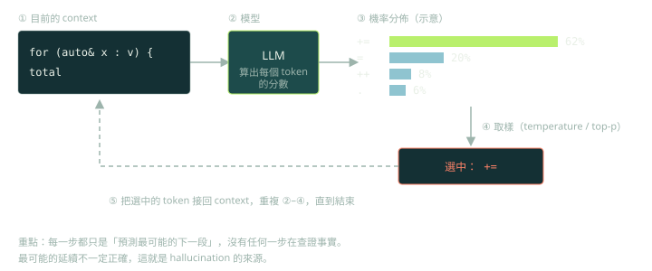

這一章整理《Coding with AI》第 1 章對「AI 為什麼會出錯」的解釋，並標出哪些說法要小心使用。

## 核心觀念：預測，不是查詢

書裡用「句子接龍」做比喻（p.12–13）：看到「貓坐在…」你會自然想到「墊子」，不是去查表。LLM 做的事類似，只是規模大得多：根據目前的輸入與已生成的內容，預測最可能的下一段文字。

因此「最可能的延續」不一定是「正確的答案」。當訓練資料裡某種錯誤寫法很常見，或你的問題本身含糊，模型會同樣自信地輸出錯誤內容，這就是 hallucination。它沒有一個可以對照事實的「真相資料庫」。



用 C++ 工程師熟悉的方式看，核心迴圈大致如下（示意，省略 batching 與 KV cache）：

```cpp
std::vector<int> ctx = tokenize(prompt);
while (!is_eos(ctx.back()) && ctx.size() < max_len) {
    std::vector<float> logits = model.forward(ctx);  // 每個 token 的分數
    int next = sample(logits, temperature, top_p);   // 取樣，而不是查表
    ctx.push_back(next);                             // 接回 context，再來一輪
}
```

注意迴圈裡沒有任何一行是「驗證這個 token 對不對」。驗證必須由迴圈外的系統負責。

## 書中列出的三類成因（p.13–15）

1. **LLM 不是資料庫**：資料庫會回傳存進去的東西；LLM 是用機率生成新文字，所以同一個問題可能得到不同答案，也可能組合出沒見過的內容。
2. **訓練階段的問題**：模型把訓練資料都當成同等有效，無法自己判斷對錯。書中舉的 Python 例子包括：偏好常見但次優的寫法（該用 set 卻用 list）、過度依賴熱門套件、只對常見情況正確、複製過時的寫法。
3. **誤解 context**：變數名有多重意義、函式重載、API 呼叫合法但不適用、語法正確卻違反語意慣例、需求本身含糊。

「能跑但次優」是 AI 很典型的錯誤，因為這種寫法在訓練資料裡非常常見：

```python
# 常見但次優：list 的 `in` 是線性掃描，整體 O(n^2)
seen = []
for x in items:
    if x not in seen:
        seen.append(x)

# 懂行的人會改成（要保留順序時用 dict.fromkeys，不需要時直接用 set）：
unique = list(dict.fromkeys(items))
```

兩段都「正確」，測試也都會過，差別只在規模變大時。這類問題要靠你的專業判斷與效能測試才抓得到。

## 書中建議的緩解方式

- 提供詳細規格與限制。
- 附上相關程式碼（imports、依賴、相關函式）。
- 明講錯誤處理的要求，以及預期的輸入與輸出。
- 把複雜功能拆成小而聚焦的部分。

## 進階觀點：哪些說法要校正

- **「回饋會讓模型持續學習」要小心**：書中描述你接受或拒絕建議，回饋就會回到模型、讓它學會你的習慣（p.9）。作者也註明「多數情況，不是全部」。實務上，已部署模型的權重不會因為你按一次接受就即時改變；回饋是否、如何被使用（例如日後的訓練或品質分析）依供應商與方案而異，要看資料政策。不要把「它會即時學習我的風格」當成事實。想穩定提升風格一致性，用規則檔與範例當 context。
- **「一層檢查語法、一層檢查關鍵字」是比喻**（p.8），不是真實的模型架構。
- **生產力數字是個人經驗**：作者說實作時間減少約 30%（p.4），這不是對照實驗。談生產力時，要能說明你怎麼量（第 8 週會處理）。
- **最重要的結論**：既然模型會自信地出錯，就要把「看起來對」變成「可執行的檢查」：型別檢查、單元測試、linter、實際跑一次。

## 檢查點

Q: 一位同事說：「Copilot 會從我每次接受的建議中即時學習，所以用越久就越懂我們的程式風格。」哪個回應最準確？
- [ ] 完全正確，模型權重會在每次接受時立即更新
- [x] 不該當成事實：已部署模型的權重不會因單次互動即時改變，回饋如何被使用要看供應商政策；要穩定提升風格一致性，應提供規則檔與範例作為 context
- [ ] 完全錯誤，模型從不使用任何形式的使用者回饋
- [ ] 只有開源模型才會即時學習
解釋: 書中把回饋迴圈說得很直觀，但「即時學習個人習慣」是過度簡化。真正可控、可驗證的做法是把團隊慣例寫進規則檔與範例，每次都放進 context，而不是依賴模型「記住」你。

## 思考練習

Q: 團隊裡有人說「AI 寫的程式碼看起來很專業，應該沒問題」。你怎麼用一分鐘說服他需要驗證？
- 先講機制：模型是在預測最可能的延續，不是查證事實，所以錯誤也會寫得很自信。
- 舉具體失敗類型：幻覺的 API、對平台特性的錯誤假設、只對常見情況正確、用了過時寫法。
- 提出做法而不是只提醒：型別檢查、測試、linter 當作合併條件，並要求 agent 實際執行。
- 補一個數字或紀錄：用過去的失敗案例，或自己團隊的小型試驗，說明驗證抓到了多少問題。
