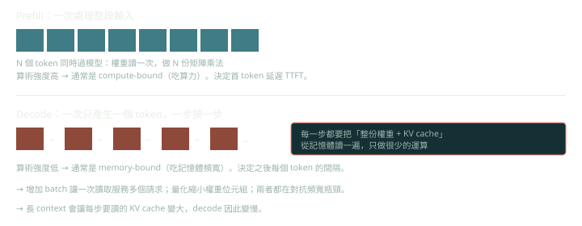

**Prefill** 一次處理整段輸入，矩陣乘法的規模夠大，通常 compute-bound；FLOPs 大約是 `2 × 參數量 × 輸入 token 數`（再加上與長度相關的 attention 成本）。**Decode** 一次只產生一個 token，每步都要讀整份權重與 KV cache，通常 memory-bound。

這個差異解釋了幾個常見現象：

- **首 token 延遲（TTFT）** 主要由 prefill 決定：prompt 越長越慢。prompt caching 命中時就能跳過大部分 prefill。
- **之後每個 token 的間隔（TPOT）** 主要由 decode 決定：受記憶體頻寬與 KV cache 大小影響。
- 服務端會把 prefill 與 decode 的請求混在同一批排程，或甚至分到不同機器（prefill/decode 分離），因為兩者的資源需求不同。

**Speculative decoding**：用一個小的 draft 模型先連續猜 k 個 token，再讓大模型**一次平行驗證**這 k 個 token（驗證的成本接近一步 decode，因為是 memory-bound，多算幾個 token 幾乎不增加時間）。採用適當的接受／拒絕規則時，輸出分佈與只用大模型取樣相同，所以是「無損加速」。效果取決於 draft 的接受率：任務越可預測（例如程式碼樣板）接受率越高。
