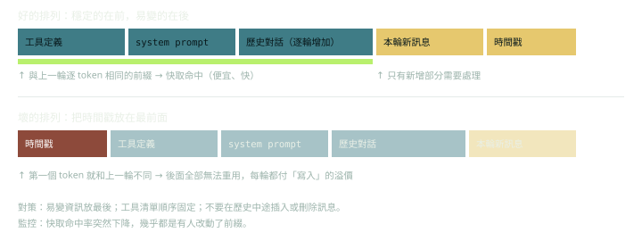

快取的本質：服務端把已處理前綴的內部狀態（KV cache）保留一段時間，下一個請求若有**逐 token 相同的前綴**，就重用它。幾個實作上的重點：

- **前綴比對**：從第一個 token 開始，任何一處不同，之後全部失效。順序因此是穩定的在前、易變的在後。
- **斷點（breakpoint）**：有些 API 讓你標記「快取到這裡」，有些則自動決定。要看你所用供應商的規則，包括最小可快取長度。
- **存活時間（TTL）**：快取會過期，通常以數分鐘計，部分供應商提供較長的選項（價格不同）。每次命中通常會延長存活時間。互動間隔長於 TTL 的產品，實際命中率會比理論低。
- **計價**：通常寫入比一般輸入貴一點，命中讀取便宜很多。確切倍率以官方定價頁為準。

上線後要看的指標：

1. **命中率** = 讀取的快取 token ÷ 全部輸入 token。
2. **每個任務的成本**與**首 token 延遲**。
3. **命中率的突然下降**：幾乎都是有人改了前綴（工具清單排序、system prompt、時間戳、隨機 ID）。把它當成 prompt 變更的回歸警報。

請求內容的排列，原則上像這樣（欄位名稱是示意，細節依各供應商的 API）：

```json
{
  "tools":   ["...固定順序，不要每輪重排..."],
  "system":  "...穩定的指示與規則...",
  "messages": [
    {"role": "user",      "content": "（歷史）只在尾端追加，不改動前面的"},
    {"role": "assistant", "content": "..."},
    {"role": "user",      "content": "本輪新訊息
[context] now=2026-10-03T14:07"}
  ]
}
```

注意時間戳被放在最後一則訊息，而不是 system 的開頭。

常見破壞快取的錯誤：在 system prompt 放當前時間、每輪重新排序工具、把使用者名稱放在最前面、動態產生的範例每次不同、在歷史中間插入或刪除訊息。
