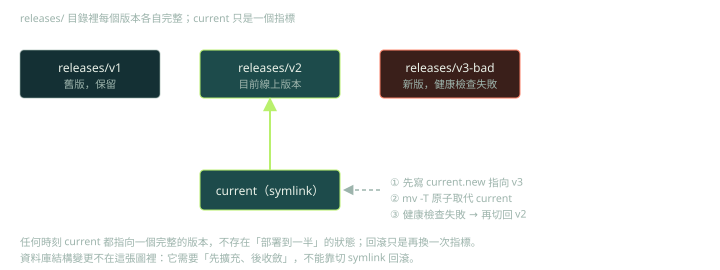

第 9 章最後談部署與上線之後的事：部署的風險與自動化、雲端日誌與告警查詢、使用者回饋的分析，以及發佈的行銷內容（p.55–59）。這些任務有一個共同點：**輸出會被賦予權限或影響真實使用者**，錯誤的代價比一般程式碼高。這一篇把重點放在如何驗證 AI 寫的維運腳本，以及怎麼把「用 LLM 分析回饋」當成一個要被評估的分類器。

標示方式：**【書】** 書中的說法（附頁碼）；**【實測】** 我在沙箱實際執行的結果；**【判斷】** 我的工程判斷。

## 書的內容

**部署（p.55–57）**

- **【書】** 部署像是屏住呼吸、希望一切順利：測試環境一切完美，上線後可能因為不同的硬體、網路或設定而出狀況；還要顧安全與隱私、承受使用量、做 CI/CD 自動化（p.55–56）。
- **【書】** 作者列出一串部署相關 prompt：建立部署檢查表、學習 Docker 的資源、零停機部署的最佳實踐、處理「伺服器逾時」錯誤、用 bash 自動化部署 Python 網頁應用、上線前要檢查的設定、失敗部署的回滾策略、金融應用的安全措施、優化 Node.js 應用的效能（p.56）。
- **【書】** Titus Capilnean 的經驗：他不是 DevOps 工程師，但要常處理 AWS 與 Google Cloud 日誌。他請 ChatGPT 寫出 AWS CloudWatch 的查詢，為「SQS 加 Lambda」的流程追蹤處理狀態並產生報告，調整到可以直接在每次處理結束時執行；他估計若自己讀文件，大約要花 5–6 小時，用這個方式省下了大量時間（p.56）。他也用同樣的方式為 Google Cloud 建立告警，排除非使用者面向的系統層級錯誤，並做出自訂指標（p.56–57）。

**使用者回饋（p.57–58）**

- **【書】** 回饋是軟體成功的關鍵；有些 bug 只有上線後才會浮現（p.57）。生成式 AI 特別擅長處理大量**非結構化**資料，例如回饋；範例 prompt：找出常見主題與類別（可用性、效能、功能、bug、客服）、做情緒分析、依頻率與嚴重度排序該先修哪些、並產生含圖表的報告（p.57）。
- **【書】** 另一個應用是草擬回覆與範本；還有人自己做出以 LLM 為基礎的應用：Warp 的一位開發者花不到一週（半時間）用 OpenAI API 做出回饋分類的應用，產品經理說它大幅改善了過去難以分類與排序的狀況（p.58）。

**發佈（p.58–59）**

- **【書】** 作者提醒生成式 AI 早在 ChatGPT 之前就用在銷售與行銷（Jasper），並列了大量行銷 prompt：行銷計畫、部落格、社群貼文、產品公告信、銷售信、名稱發想、廣告文案、感謝推薦的範本、線上發表會邀請（p.58–59）。

## 部署：AI 寫的腳本，用「有權限的程式碼」的標準審查【判斷】

部署腳本會在有權限的環境下執行，出錯的後果是刪資料、停服務。AI 產生的腳本常見這些問題：

| 檢查項目 | 為什麼重要 |
|---|---|
| `set -euo pipefail`，以及變數用 `${VAR:?}` 保護 | 變數沒設定時，`rm -rf "$DIR/"` 會變成刪除根目錄 |
| 可重複執行（idempotent） | 失敗後重跑不會把狀態弄得更糟 |
| `--dry-run` | 先看會做什麼，再執行 |
| 先驗證、再切換；失敗能回滾 | 避免把壞版本留在線上 |
| 最小權限 | 腳本用的身分只能做它要做的事 |
| 祕密不寫死、不印進日誌 | 日誌常被集中保存與分享 |
| 明確處理部分失敗 | 做到一半失敗時，系統要處於可恢復的狀態 |



## Lab 1：原子切換、回滾與 dry-run

下面是一個單機示意版本，把上面清單的前幾項具體化。

```bash
#!/usr/bin/env bash
# 原子切換 symlink 的部署、健康檢查與自動回滾（單機示意）
set -euo pipefail
ROOT="${DEPLOY_ROOT:?DEPLOY_ROOT 未設定}"          # 沒設就中止，避免對 "/" 動手
VERSION="${1:?用法: deploy.sh <version> [--dry-run]}"
DRY="${2:-}"
run() { if [[ "$DRY" == "--dry-run" ]]; then echo "[dry-run] ${*//"$ROOT"/\$ROOT}"; else "$@"; fi; }
health_check() { [[ "$VERSION" != *bad* ]]; }       # 示意：版本名稱含 bad 就判定失敗
name_of() { basename "$(readlink "$1" 2>/dev/null || echo '<無>')"; }

mkdir -p "$ROOT/releases"
prev="$(readlink "$ROOT/current" 2>/dev/null || true)"
run mkdir -p "$ROOT/releases/$VERSION"
run bash -c "echo 'build $VERSION' > '$ROOT/releases/$VERSION/app.txt'"
run ln -sfn "$ROOT/releases/$VERSION" "$ROOT/current.new"
run mv -T "$ROOT/current.new" "$ROOT/current"       # rename 是原子操作：任何時刻 current 都指向完整版本
[[ "$DRY" == "--dry-run" ]] && exit 0

if health_check; then
  echo "OK    current -> $(name_of "$ROOT/current")"
else
  echo "FAIL  健康檢查失敗，回滾到: ${prev:+$(basename "$prev")}"
  if [[ -n "$prev" ]]; then
    ln -sfn "$prev" "$ROOT/current.new" && mv -T "$ROOT/current.new" "$ROOT/current"
  fi
  echo "      current -> $(name_of "$ROOT/current")"
  exit 1
fi
```

把上面存成 `deploy.sh`，用下面的指令操縱它：

```bash
export DEPLOY_ROOT="$(mktemp -d)"
bash deploy.sh v1
bash deploy.sh v2
bash deploy.sh v3-bad || echo "（結束碼 $?）"
bash deploy.sh v4 --dry-run
echo "--- 未設定 DEPLOY_ROOT："
( unset DEPLOY_ROOT; bash deploy.sh v1 2>&1 | head -1 )
```

**【實測】** 輸出：

```text
OK    current -> v1
OK    current -> v2
FAIL  健康檢查失敗，回滾到: v2
      current -> v2
（結束碼 1）
[dry-run] mkdir -p $ROOT/releases/v4
[dry-run] bash -c echo 'build v4' > '$ROOT/releases/v4/app.txt'
[dry-run] ln -sfn $ROOT/releases/v4 $ROOT/current.new
[dry-run] mv -T $ROOT/current.new $ROOT/current
--- 未設定 DEPLOY_ROOT：
deploy.sh: line 4: DEPLOY_ROOT: DEPLOY_ROOT 未設定
```

重點：

- 壞版本（v3-bad）被偵測到，`current` 切回 v2，結束碼為 1，讓外層的 CI 知道失敗。
- dry-run 把每個動作印出來而不執行，預覽變得可以審查。
- 少了 `DEPLOY_ROOT` 時直接中止，不會對錯誤的路徑動手。

**這個示意有刻意保留的限制，審查 AI 的腳本時要能說出來：**

1. 它把健康檢查放在**切換之後**，所以壞版本會短暫接到流量。正式的做法是先在旁路驗證（預備埠、金絲雀、預備環境），確認健康才切換。
2. 它只管檔案。**資料庫結構變更不能靠切 symlink 回滾**，要用「先擴充、再遷移資料、最後收斂」的步驟，並且在新舊版本同時存在的期間，兩邊都要相容。
3. 它沒有處理連線排空（正在處理的請求）、多台機器的協調，以及切換的審計紀錄。

## 雲端日誌與告警查詢：用歷史事件回放驗證【判斷】

Capilnean 的案例（p.56–57）是 AI 很擅長的任務：查詢語法複雜、文件冗長、結果可以立刻檢驗。但**告警查詢有一個特別的風險：它失敗時是靜默的**。寫錯的告警不會報錯，只是在該響的時候不響。驗證方法：

1. **對答案**：在已知答案的小時段，用手算或另一個工具計數，和查詢結果對照。
2. **歷史回放（backtest）**：把查詢套用到過去一次真正的事故時段，問「它那時會觸發嗎？」會，才算有效；不會，就是漏報。
3. **反向測試**：在預備環境人為製造錯誤，確認告警真的送出，並且被送到正確的人。
4. **排除條件要有紀錄**：書中「排除非使用者面向的系統錯誤」（p.56–57）的條件，是有風險的設計決定，要寫下理由與負責人。

## Lab 2：把「用 LLM 分析回饋」當成分類器來評估

書的作法是把回饋交給 LLM 分類（p.57–58）。**不管分類器是 LLM、規則，還是人，評估方法都一樣：** 有一份人工標註的樣本，計算每個類別的精確率與召回率，並看混淆與錯誤清單。下面用一份**合成的**示意資料（18 筆，不是真實使用者回饋）與一個關鍵字規則當基線，示範評估的骨架：

```python
from collections import Counter
LABELS = ["bug", "perf", "feature", "praise"]
labeled = [  # 示意用的合成資料，不是真實使用者回饋
 ("App crashes when I upload a large photo", "bug"),
 ("Export is broken since the last update", "bug"),
 ("Love it, but export crashes every time", "bug"),
 ("Error 500 when saving settings", "bug"),
 ("Search is so slow on big projects", "perf"),
 ("Loading the dashboard takes forever", "perf"),
 ("It lags a lot on my old laptop", "perf"),
 ("Memory usage keeps growing until it freezes", "perf"),
 ("Please add dark mode", "feature"),
 ("Would be great to have SSO support", "feature"),
 ("I wish I could export to PDF", "feature"),
 ("Support for Markdown tables please", "feature"),
 ("Love the new editor, thanks!", "praise"),
 ("Awesome release, great work", "praise"),
 ("Best tool I have used this year", "praise"),
 ("Thanks, the onboarding was smooth", "praise"),
 ("It is slow and I wish there was a faster mode", "perf"),
 ("Great app but it crashed twice today", "bug"),
]
RULES = [("praise", ["love", "great", "awesome", "thanks", "best"]),
         ("feature", ["please add", "would be great", "wish", "support for"]),
         ("perf", ["slow", "lag", "forever", "freeze"]),
         ("bug", ["crash", "error", "broken"])]

def baseline(text):                     # 任何分類器（LLM、規則、人）都用同樣的介面接進來
    t = text.lower()
    for label, kws in RULES:
        if any(k in t for k in kws):
            return label
    return "bug"

def report(pairs):
    conf = Counter(pairs)
    f1s = []
    for c in LABELS:
        tp = conf[(c, c)]; fp = sum(conf[(o, c)] for o in LABELS if o != c); fn = sum(conf[(c, o)] for o in LABELS if o != c)
        p = tp / (tp + fp) if tp + fp else 0; r = tp / (tp + fn) if tp + fn else 0
        f1 = 2 * p * r / (p + r) if p + r else 0; f1s.append(f1)
        print(f"{c:8s} P={p:.2f} R={r:.2f} F1={f1:.2f}  (n={tp+fn})")
    acc = sum(v for (t, p), v in conf.items() if t == p) / len(pairs)
    print(f"accuracy={acc:.2f} macro-F1={sum(f1s)/len(f1s):.2f}")
    print("錯誤清單:")
    for text, truth in labeled:
        pred = baseline(text)
        if pred != truth: print(f"  真={truth:8s} 預測={pred:8s} {text}")

report([(truth, baseline(text)) for text, truth in labeled])
```

**【實測】** 輸出：

```text
bug      P=1.00 R=0.60 F1=0.75  (n=5)
perf     P=1.00 R=0.80 F1=0.89  (n=5)
feature  P=0.75 R=0.75 F1=0.75  (n=4)
praise   P=0.57 R=1.00 F1=0.73  (n=4)
accuracy=0.78 macro-F1=0.78
錯誤清單:
  真=bug      預測=praise   Love it, but export crashes every time
  真=feature  預測=praise   Would be great to have SSO support
  真=perf     預測=feature  It is slow and I wish there was a faster mode
  真=bug      預測=praise   Great app but it crashed twice today
```

這份輸出的價值在**錯誤清單**：四個錯誤裡有三個是「一句話同時出現讚美與 bug」，也就是類別本身有重疊。這不是分類器的問題，而是**分類體系的定義問題**：一筆回饋可以有多個標籤嗎？要看主要意圖，還是全部？沒有先決定，LLM 與人也會不一致。

**把 LLM 當分類器的評估清單：**

1. **先定義分類體系與判定規則**，並用幾十筆樣本讓兩個人各自標註，檢查一致性。人都不一致的任務，不要期待模型一致。
2. **標註樣本要有代表性、數量足夠**：上面的 18 筆只是示範骨架。每個類別要有足夠的樣本，並且包含難例，才能對精確率與召回率有信心，結果要附上不確定性（信賴區間）。
3. **一定要有基線**：關鍵字規則、上一版、人。LLM 要證明它**比便宜的基線好**，而且好多少。
4. **用結構化輸出並驗證 schema**：要求固定的 JSON 格式與合法的類別，程式端驗證，不合法就重試或標記。
5. **持續監控**：回饋的內容、產品與模型版本都會變，要定期用新的標註樣本重測。
6. **隱私**：回饋可能含有個資。送給外部 LLM 前先去識別化，並確認供應商的資料保存與訓練政策（見 Week 6 風險登記表）。
7. **成本與延遲**：量大時，先用便宜的規則或小模型過濾，再把難例交給大模型。

**【書】** Warp 的例子（p.58）是一位產品經理的**證言**：一位開發者不到一週做出應用，而且效果很好。**【判斷】** 它是有價值的存在證明，但不是基準：沒有標註樣本、沒有基線、沒有指標。引用時要註明它的證據等級。

## 發佈與行銷文案（p.58–59）

行銷文案不在工程範圍內，但有一個工程師該知道的風險：AI 會寫出**自信、流暢、但不一定屬實**的宣稱。任何對外的功能描述、效能數字、「比競品快幾倍」，都要由知道事實的人核對，並且有出處。

## 檢查點

Q: 主管看到 Warp 的案例（p.58），要求你「用 LLM 自動分類所有客服回饋，下週上線」。你最先要求的是什麼？
- [ ] 直接使用，因為已經有人成功了
- [ ] 先選最貴的模型，之後再調整
- [x] 先定義分類體系，並標註一份有代表性的樣本，用基線與 LLM 一起評估精確率與召回率，再決定是否上線
- [ ] 完全不要用 LLM，因為它不可靠
解釋: 別人的成功案例是證言，不是你的資料的評估。沒有標註樣本與基線，你無法知道它在你的資料上有多好、有沒有比便宜的規則好，也無法在日後偵測退化。

## 思考練習

Q: 同事用 AI 寫了一支部署腳本，說「我跑過一次，沒問題」。請列出你審查這支腳本時會問的問題與要求補上的保護。
- 變數保護與嚴格模式：未設定的變數、錯誤時中止，並避免對危險路徑執行刪除。
- 可重複執行與 dry-run：失敗後重跑的結果，以及能預覽將要執行的動作。
- 驗證與回滾：切換前後的健康檢查、失敗時的自動回滾，以及資料庫變更的處理。
- 權限與祕密：腳本使用的身分是否最小權限；祕密是否被印出或寫死。
- 在預備環境與壞版本上實際演練過一次，而不是只跑過成功路徑。
