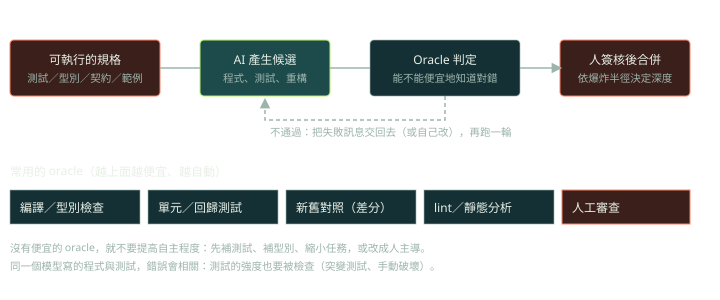

Taulli 把重構稱為 AI 輔助工具的強項之一，並介紹了四種常見的重構：解開「忍者程式碼」、extract method、decompose conditional、改名，另外談到刪除 dead code（p.30–33）。這篇的重點是：**重構的定義裡包含「行為不變」，所以每一次重構都需要 oracle 來證明**，AI 做的重構尤其如此。

標示方式：**【書】** 書中的說法（附頁碼）；**【實測】** 我在沙箱實際執行的結果；**【判斷】** 我的工程判斷。

## 書中的內容（p.30–33）

- **【書】** 重構像是春季大掃除：整理、重組，不新增功能、不修 bug；好處是程式更健康、更直覺，對所有維護者都省事。作者認為這是 AI 工具表現好的領域（p.30）。
- **【書】** **忍者程式碼**：炫技、難以理解、寫的人事後也看不懂。範例是一行 JavaScript：`console.log((function(n, a = 0, b = 1) { while (--n) [a, b] = [b, a + b]; return a; })(10));`。作者請 ChatGPT 逐步解釋並改寫成較易維護的版本（p.30），結果是一個 `for` 迴圈版的 `calculateFibonacci`（Fig 8-5，p.31）。
- **【書】** **Extract method**：把長函式中專注於某件事的片段抽成新函式，更好讀、可重用、出錯時容易隔離（p.31）。
- **【書】** **Decompose conditional**：把冗長的條件式抽成命名清楚的方法，例如把 `user.isActive() && user.hasSubscription() && !user.isBlocked()` 抽成 `canUserAccessContent()`；then 與 else 區塊也可以各自抽成方法（p.32）。
- **【書】** **改名**：可以大幅提升可讀性；但用 Copilot 這類工具時要小心，改了名稱可能弄壞仍在使用舊名稱的地方（p.32–33）。
- **【書】** **Dead code**：作者提醒用 LLM 找 dead code 有風險，看似陳舊的程式可能對罕見情境很重要，移除一處還可能牽動其他依賴；而且生成式 AI 未必真正理解關係。他建議改用 linter（ESLint、Pylint、RuboCop）與靜態分析工具（SonarQube、Code Climate、Coverity）（p.33）。

## 重構的 oracle：四種，由便宜到昂貴【判斷】

1. **編譯器與型別檢查**：抓住改名遺漏、簽章不一致。便宜、全自動，但只管「型別對不對」。
2. **既有測試**：只對有測試的行為有保護。覆蓋率低就等於沒保護。
3. **Characterization test（golden master）**：沒有測試的遺留程式，先把「現在的行為」記錄成測試，不管對錯，再動手改。
4. **Differential test**：對同一批輸入跑新舊兩版，逐筆比較。重構與 AI 改寫的主力工具，成本取決於你能不能產生有代表性的輸入。



## Lab 1：書中的忍者程式碼，真的和重構版等價嗎？

下面用 Node.js 對書中那行忍者程式碼，與書中 Fig 8-5 的重構版做法（重寫）做差分測試。**對舊版一定要加逾時**，因為舊版可能不會結束。

```python
import subprocess
ninja = "(function(n,a=0,b=1){while(--n)[a,b]=[b,a+b];return a;})"
clean = "(function(n){let a=0,b=1;for(let i=1;i<n;i++){const next=a+b;a=b;b=next;}return a;})"

def run(fn, n):
    try:
        r = subprocess.run(["node", "-e", f"console.log({fn}({n}))"], capture_output=True, text=True, timeout=2)
        return r.stdout.strip() or "ERR"
    except subprocess.TimeoutExpired:
        return "HANG(>2s)"

for n in [10, 1, 2, 3, 40, 0, -3, 2.5]:
    o, c = run(ninja, n), run(clean, n)
    print(f"n={n!s:5} ninja={o:10} clean={c:10} {'same' if o == c else 'DIFF'}")
print("n=1..30 全部相同:", all(run(ninja, n) == run(clean, n) for n in range(1, 31)))
```

**【實測】** 輸出：

```text
n=10    ninja=34         clean=34         same
n=1     ninja=0          clean=0          same
n=2     ninja=1          clean=1          same
n=3     ninja=1          clean=1          same
n=40    ninja=63245986   clean=63245986   same
n=0     ninja=HANG(>2s)  clean=0          DIFF
n=-3    ninja=HANG(>2s)  clean=0          DIFF
n=2.5   ninja=HANG(>2s)  clean=1          DIFF
n=1..30 全部相同: True
```

觀察：

- 在 n = 1 到 30 的正整數範圍內，兩者完全一致，書中的重構在**常見輸入**上是正確的。
- 當 n 是 0、負數或非整數時，原本的 `while (--n)` 永遠不會結束，重構版則回傳數值。**這次「行為改變」恰好是好的方向**（把無窮迴圈變成有限結果），但它仍然是行為改變。如果有呼叫端依賴「n 錯誤時卡住」的行為（例如被 watchdog 觀察），那就是迴歸。
- 注意第一個索引的慣例：這個函式回傳的是以 0 開頭的數列的第 n 項（n = 10 得 34），不是常見的 F(10) = 55。AI 的解釋是否有點明這件事，是檢查它「真的讀懂了」的好方法。

**教訓：**AI 說「這是等價的重構」是一個**主張**，不是證據。你要自己定義「等價的定義域」（哪些輸入要一致、哪些可以改善），並且用差分測試證明。

## Lab 2：把條件式「整理得更漂亮」，副作用跟著變了

書中的 decompose conditional 範例（p.32）本身沒有問題。但 AI 常見的另一種「簡化」，是把串接的 `and` 換成 `all([...])`：

```python
calls = []
def is_active(u):        calls.append("is_active");        return False
def has_subscription(u): calls.append("has_subscription"); return True    # 假設這是一次資料庫查詢
def not_blocked(u):      calls.append("not_blocked");      return True

def can_access_v1(u): return is_active(u) and has_subscription(u) and not_blocked(u)
def can_access_v2(u): return all([is_active(u), has_subscription(u), not_blocked(u)])

calls.clear(); r1 = can_access_v1("u"); c1 = list(calls)
calls.clear(); r2 = can_access_v2("u"); c2 = list(calls)
print("結果相同:", r1 == r2)
print("v1 呼叫:", c1)
print("v2 呼叫:", c2)
```

**【實測】** 輸出：

```text
結果相同: True
v1 呼叫: ['is_active']
v2 呼叫: ['is_active', 'has_subscription', 'not_blocked']
```

回傳值完全相同，所以只看輸出的測試會全部通過。但 `all([...])` 會先把三個呼叫都算完才判斷，**短路求值消失了**：本來在使用者未啟用時就會停下來、不去查資料庫，現在每次都多查兩次。若其中一個呼叫有副作用或很昂貴，這就是效能與正確性的回歸。

**Extract method 與 decompose conditional 要檢查的三件事：**求值順序、短路行為、例外傳播。測試要能「看到」呼叫次數與順序（用 mock 或呼叫紀錄），光比對回傳值不夠。

## Lab 3：為什麼「讓 AI 找 dead code」風險高

書說用 LLM 找 dead code 有風險（p.33）。下面用最簡單的靜態做法示範同一類失敗：只看名稱引用，動態分派就會被誤判。

```python
import ast

SRC = '''
class Handlers:
    def handle_refund(self, order): return "refund"
    def handle_cancel(self, order): return "cancel"
    def unused_helper(self): return 0

def dispatch(h, kind, order):
    return getattr(h, f"handle_{kind}")(order)
'''
tree = ast.parse(SRC)
defined = {n.name for n in ast.walk(tree) if isinstance(n, ast.FunctionDef)}
used = {n.attr for n in ast.walk(tree) if isinstance(n, ast.Attribute)} | {n.id for n in ast.walk(tree) if isinstance(n, ast.Name)}
print("靜態分析看起來沒被引用:", sorted(defined - used))
```

**【實測】** 輸出：

```text
靜態分析看起來沒被引用: ['dispatch', 'handle_cancel', 'handle_refund', 'unused_helper']
```

四個之中只有 `unused_helper` 真的沒用；`handle_refund` 與 `handle_cancel` 是透過 `getattr` 與字串動態呼叫的，`dispatch` 是對外的進入點。**真正的 dead code 偵測需要進入點、動態分派、反射、序列化名稱這些資訊**，這也是 LLM「看一段程式」做不到的部分。實務上要：

- 用專門工具（Python 的 vulture、TypeScript 的 knip 或 ts-prune、ESLint 的 unused 規則），並設定進入點與白名單，用法請看各工具文件。
- 對可疑的程式碼先加上執行期的觀測（紀錄是否被呼叫），再決定是否刪除。
- 刪除用獨立的 commit，方便還原。

## 改名：用語意工具，不是文字改寫

書說改名要小心（p.33）。**【判斷】** 安全的改名有三層：

1. **語意改名**：用 IDE 或 language server 的 rename 功能（根據符號解析，不是文字取代），再交給編譯器與型別檢查驗證。
2. **文字層面的殘留**：字串裡的名稱、設定檔、JSON 欄位、SQL、文件、序列化格式、對外 API。這些靠全域搜尋與測試。
3. **公開介面**：對外的 API 名稱改了，等於破壞相容性，需要棄用流程，不是一次 commit 能解決。

LLM 適合做的是「**提出**更好的名稱」（書中的 prompt，p.32），而不是「**執行**跨檔案改名」。

## 把重構交給 AI 的標準流程【判斷】

1. 先確認 oracle：有測試？沒有就先補 characterization test。
2. 一次只做一種重構，commit 要小。
3. 要求 AI 在改動前後都執行同一套測試，並貼出結果。
4. 對重構前後的行為跑差分測試（至少用隨機輸入加上你知道的邊界）。
5. 審查 diff 時特別看：求值順序、例外傳播、公開簽章、預設值、排序與相等語意。
6. 重構與功能變更**不要放在同一個 PR**。

## 檢查點

Q: AI 把 `if a() and b() and c():` 改寫成 `if all([a(), b(), c()]):`，測試全部通過。為什麼這仍然可能是迴歸？
- [ ] `all` 比 `and` 慢，所以一定是迴歸
- [x] 串列會先把三個函式都呼叫一次，短路求值消失；若有副作用或昂貴呼叫，行為與成本都改變了，而只比對回傳值的測試看不出來
- [ ] `all` 只能用在數字上
- [ ] 這是合法的風格改動，不影響行為
解釋: 兩種寫法的回傳值一致，但求值策略不同。重構要保留的是「可觀察行為」，包含副作用與呼叫次數，這就是為什麼測試要能觀察呼叫過程，而不只是回傳值。

## 思考練習

Q: 你要把一個 5,000 行、幾乎沒有測試的遺留模組，交給 AI 重構。請設計讓團隊放心的流程，並說明什麼時候應該停手。
- 先建立 oracle：用 characterization test 或從正式環境匯出的輸入與輸出樣本，把現在的行為記錄下來。
- 切成小步驟：每次一種重構、一個小 commit，每步都跑同一套測試與差分比對。
- 差分測試：對新舊兩版跑大量隨機與邊界輸入，舊版加逾時，並定義哪些差異可接受。
- 審查重點：求值順序、例外、公開介面、序列化名稱、動態分派。
- 停手的訊號：差分測試無法涵蓋的領域（金額、時間、併發），或差異清單越來越長、無法解釋。這時改成人主導，AI 只當解釋者。
