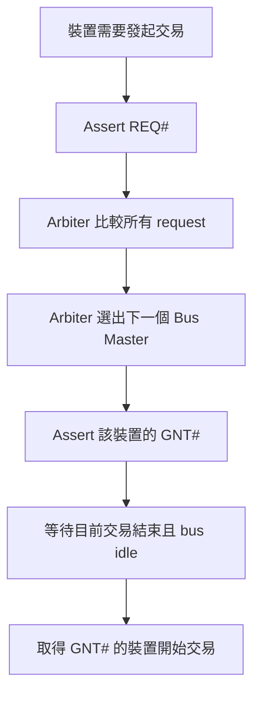
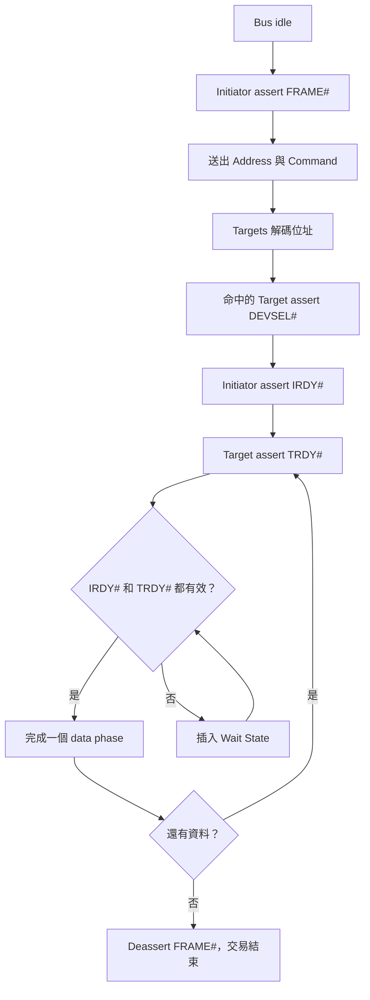
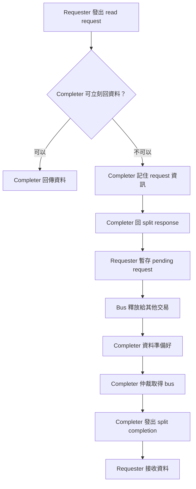
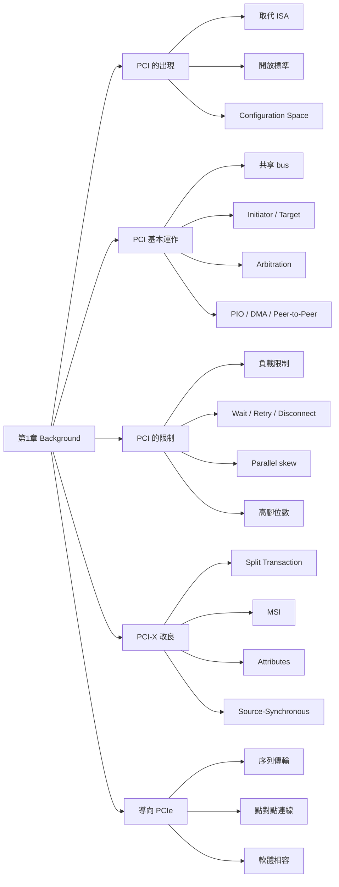
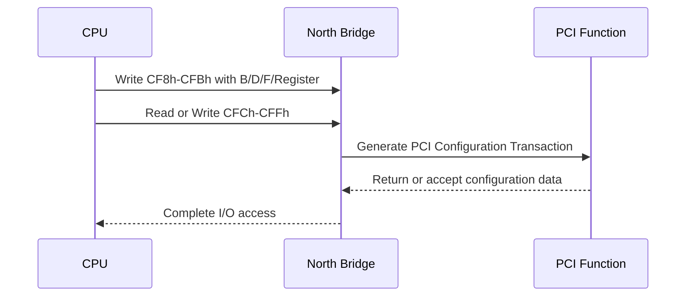

# 第1章：Background

---

## 一、本章重點（Executive Summary）

- 本章的目的，是先建立 PCI Express（PCIe）的歷史背景：PCIe 不是憑空出現，而是為了解決 PCI 與 PCI-X 的限制。
- PCI（Peripheral Component Interface）在 1990 年代初期出現，用來取代 ISA 等舊式周邊匯流排，提供更高頻寬與更好的隨插即用能力。
- PCI 的重要特色是「共享平行匯流排」：多個裝置共用同一組訊號線，因此一次只能有一個 Bus Master 使用匯流排。
- PCI 使用設定空間（Configuration Space），讓軟體能辨識裝置、讀取資源需求、分配記憶體與 I/O 位址，這是隨插即用的基礎。
- PCI 的資料傳輸模型包含 Programmed I/O、DMA、Peer-to-Peer，其中 DMA 是現代系統中較有效率的資料搬移方式。
- PCI 的仲裁（Arbitration）讓多個可發起交易的裝置輪流使用匯流排，避免某個裝置長期霸占匯流排。
- PCI 為了降低成本使用多工訊號線，例如位址與資料共用 AD 線，但這也造成 turn-around cycle，降低效率。
- PCI 的 Retry 與 Disconnect 機制可避免匯流排被等待中的交易長時間占用，但也代表共享匯流排本身有使用效率問題。
- PCI 的平行匯流排受限於訊號傳播時間、反射波訊號、負載數量、clock skew、signal skew，因此頻率越高，可支援的插槽與裝置越少。
- PCI-X 是 PCI 的延伸，維持硬體與軟體相容，但加入 split transaction、MSI、transaction attributes 等機制，提高效率。
- PCI-X 2.0 使用 source-synchronous clocking、DDR/QDR 與 ECC，進一步提高頻寬與可靠性，但成本、腳位數與平行匯流排限制仍然存在。
- 本章最後導向 PCIe 的核心動機：改用序列、點對點、封包式互連，同時盡量維持軟體相容性。

---

## 二、本章完整說明（用白話解釋）

### 1. 為什麼學 PCIe 前要先懂 PCI 與 PCI-X？

#### 這是什麼？

PCIe 是後來的互連技術，但它保留了許多 PCI 的軟體模型，例如裝置探索、設定空間、Bus/Device/Function 編號、記憶體與 I/O 資源分配。因此，理解 PCI 的運作方式，就像先看懂城市舊道路規劃，再學高速鐵路如何接上原本城市交通系統。

#### 為什麼需要？

如果只看 PCIe 的高速序列訊號，會誤以為 PCIe 是完全不同的世界。但對作業系統與驅動程式而言，PCIe 很多概念仍延續自 PCI。這種相容性降低了從 PCI/PCI-X 遷移到 PCIe 的成本。

#### 怎麼運作？

PCIe 在實體層改成序列點對點連線，但在軟體層仍保留 PCI 的設定與資源模型。軟體仍可用類似方式找到裝置、讀取 Vendor ID/Device ID、設定 BAR、配置中斷。

#### 真實例子

一張 PCIe 網卡在系統開機時，仍會被 BIOS/UEFI 或 OS 掃描。系統會讀它的設定空間，知道它需要多少 MMIO 空間，再把一段位址分配給它。這個觀念來自 PCI 時代。

#### 容易誤解的地方

不要把 PCIe 的「實體連線方式」與「軟體模型」混在一起。PCIe 的電氣與傳輸方式和 PCI 差很多，但軟體看到的許多模型是延續的。

---

### 2. PCI 為什麼取代 ISA？

#### 這是什麼？

ISA 是更早期 PC 使用的周邊匯流排，適合 16-bit 286 等早期系統。隨著 32-bit CPU 與更快周邊出現，ISA 的頻寬、插槽、設定能力都不足。

#### 為什麼需要？

新系統需要：

- 更高資料傳輸速度
- 更少手動設定
- 更好的裝置資源管理
- 更開放的標準

PCI 由 PCISIG 推動成為開放標準，提供高於 ISA 的效能，並定義 Configuration Space，讓軟體能看見裝置資源需求。

#### 怎麼運作？

PCI 裝置內有標準化設定暫存器。系統軟體可讀取這些暫存器，知道裝置是什麼、需要哪些位址空間、是否支援中斷等。這讓系統能自動配置資源，減少傳統跳線或手動設定。

#### 真實例子

早期 ISA 音效卡可能需要手動設定 IRQ、I/O address。PCI 音效卡則可由系統掃描並配置資源，使用者不需要手動調一堆硬體設定。

#### 容易誤解的地方

PCI 的成功不只是因為比較快，也因為它讓軟體能標準化管理硬體。

> 📖【原始 PDF 圖片】
>
> 建議插入：表 1-1 Comparison of Bus Frequency, Bandwidth and Number of Slots
>
> 用途：這張表可幫助讀者看到 PCI/PCI-X 在頻率、頻寬、插槽數之間的取捨。重點是頻率越高，通常可支援的插槽越少，這正是平行共享匯流排的限制。

---

### 3. PCI 基本系統架構

#### 這是什麼？

傳統 PCI 系統通常有 North Bridge 與 South Bridge。North Bridge 連接 CPU、記憶體、圖形匯流排與 PCI；South Bridge 連接較慢或傳統周邊。

#### 為什麼需要？

CPU、記憶體、顯示卡、硬碟、網卡、USB 等裝置速度差異很大。晶片組用分層方式把高速與低速裝置分開管理。

#### 怎麼運作？

PCI 匯流排上可掛多個裝置。每個裝置可直接焊在主機板上，也可透過插槽插入。多個裝置共享同一組 PCI 訊號線。

#### 真實例子

在舊 PC 中，乙太網路控制器、SCSI 控制器、音效晶片可能都掛在同一條 PCI 33 MHz 匯流排上。它們不能同時傳輸，只能輪流使用匯流排。

#### 容易誤解的地方

共享匯流排不是每個裝置都有自己的專用通道。它比較像一條單線道道路，大家都要排隊通過。

> 📖【原始 PDF 圖片】
>
> 建議插入：圖 1-1 Legacy PCI Bus-Based Platform
>
> 用途：說明早期 PCI 平台中 Processor、North Bridge、South Bridge、Memory、AGP 與 PCI 裝置的連接方式。讀者應觀察多個 PCI 裝置如何共享同一條 PCI 33 MHz 匯流排。

---

### 4. PCI Bus Initiator、Target 與仲裁

#### 這是什麼？

PCI 交易中，發起存取的一方稱為 Initiator 或 Bus Master，被存取的一方稱為 Target。因為 PCI 是共享匯流排，所以 Bus Master 必須先向仲裁器要求使用權。

#### 為什麼需要？

如果多個裝置同時驅動同一組訊號線，資料會衝突，甚至可能造成硬體問題。因此需要仲裁器決定誰先用。

#### 怎麼運作？

- 裝置用 REQ# 表示「我想使用匯流排」
- 仲裁器用 GNT# 表示「下一個輪到你」
- 前一筆交易結束且匯流排空閒後，取得 GNT# 的裝置可開始交易

#### 真實例子

網卡要把封包寫入記憶體，SCSI 控制器也要讀取資料。兩者都可能是 Bus Master，但 PCI 仲裁器會決定誰先取得匯流排。

#### 容易誤解的地方

GNT# 不代表裝置立刻能傳資料，而是代表匯流排空閒後它可以成為下一個 Master。

> 📖【原始 PDF 圖片】
>
> 建議插入：圖 1-2 PCI Bus Arbitration
>
> 用途：展示 REQ#/GNT# 成對訊號與仲裁器的角色。讀者應注意每個 Bus Master 都需要透過仲裁取得共享匯流排控制權。

---

### 5. 典型 PCI Bus Cycle

#### 這是什麼？

PCI bus cycle 是一次 PCI 交易的時序流程。它包含位址階段、資料階段、等待狀態，以及控制訊號握手。

#### 為什麼需要？

PCI 是同步匯流排，訊號要在 clock edge 上被送出或取樣。為了讓 Initiator 與 Target 知道何時傳輸資料，需要一組控制訊號。

#### 怎麼運作？

典型讀取交易會經過：

1. 匯流排空閒，仲裁器已選好下一個 Master。
2. Initiator 拉低 FRAME#，送出位址與命令。
3. Target 解碼位址，看自己是不是被存取的裝置。
4. Initiator 用 IRDY# 表示自己準備好。
5. Target 用 DEVSEL# 表示自己接下交易。
6. Target 用 TRDY# 表示資料準備好。
7. IRDY# 與 TRDY# 同時有效時，資料才真正傳輸。
8. 如果任一方暫時沒準備好，就插入 Wait State。

#### 真實例子

CPU 透過 North Bridge 讀取 PCI 網卡暫存器。North Bridge 是 Initiator，網卡是 Target。網卡可能需要幾個 clock 才能準備好資料，因此 TRDY# 可能延後。

#### 容易誤解的地方

資料不是只要發出位址就立刻回來。PCI 需要雙方 ready 訊號都成立，才算完成資料階段。

> 📖【原始 PDF 圖片】
>
> 建議插入：圖 1-3 Simple PCI Bus Transfer
>
> 用途：用時序圖展示 FRAME#、AD、C/BE#、IRDY#、TRDY#、DEVSEL#、GNT# 的互動。讀者應特別看 Wait State 與 turn-around cycle 對效率的影響。

---

### 6. Reflected-Wave Signaling 與 PCI 的物理限制

#### 這是什麼？

Reflected-wave signaling 是 PCI 為降低功耗與成本使用的訊號方式。驅動器先把訊號推到約一半電壓，訊號到線尾反射回來後疊加成完整電壓。

#### 為什麼需要？

弱驅動器比較省電、成本較低，符合 PCI 當初的低成本設計目標。

#### 怎麼運作？

訊號從傳送端沿線路前進，到未終端處反射，再返回傳送端。接收端要等訊號穩定到有效電壓才能取樣。因此總時間包含傳播時間、反射延遲與 setup time。

#### 真實例子

33 MHz PCI clock 約 30 ns。訊號必須在一個 clock 週期內完成傳播、反射並被接收端穩定取樣。如果線太長或負載太多，訊號來不及穩定。

#### 容易誤解的地方

PCI 規格理論上可有較多裝置，但實際電氣負載限制更嚴格。插槽插上卡後通常算更多負載，因此 33 MHz PCI 常見只能支援約 4 到 5 個插槽。

> 📖【原始 PDF 圖片】
>
> 建議插入：圖 1-4 PCI Reflected-Wave Signaling
>
> 用途：說明訊號傳播、反射與 setup time 如何共同吃掉 clock timing budget。讀者應觀察 33 MHz 下的時間限制。

---

### 7. PCI Bridge 與拓樸擴充

#### 這是什麼？

PCI-to-PCI Bridge 可建立新的 PCI bus，讓下游裝置與上游 bus 電氣隔離。

#### 為什麼需要？

單一 PCI bus 可承受的電氣負載有限。若要接更多裝置，就必須透過 Bridge 建立第二條、第三條 bus。

#### 怎麼運作？

Bridge 一邊連上游 bus，另一邊建立下游 bus。系統最多可支援 256 個 bus，每個 bus 最多 32 個 device，每個 device 最多 8 個 function。

#### 真實例子

主機板上若需要多個 PCI 插槽，可能透過 PCI-to-PCI Bridge 把某些插槽放在 secondary bus。

#### 容易誤解的地方

Bridge 不是單純延長線。它是拓樸元件，會建立新的 bus number 範圍，並參與交易轉送與設定。

> 📖【原始 PDF 圖片】
>
> 建議插入：圖 1-5 33 MHz PCI System, Including a PCI-to-PCI Bridge
>
> 用途：展示 Bridge 如何建立 Secondary PCI Bus，讓系統能連接更多裝置。

---

### 8. PCI 的三種交易模型：PIO、DMA、Peer-to-Peer

#### 這是什麼？

PCI 支援三種資料搬移方式：

- Programmed I/O：CPU 親自搬資料
- DMA：由 DMA engine 或 Bus Master 裝置搬資料
- Peer-to-Peer：一個 PCI 裝置直接和另一個 PCI 裝置傳資料

#### 為什麼需要？

不同應用對效率與複雜度需求不同。PIO 簡單但浪費 CPU；DMA 效率高；Peer-to-Peer 理論上可避免經過 CPU/Memory，但實務上較少用。

#### 怎麼運作？

PIO 中，CPU 讀裝置資料到暫存器，再寫到記憶體。DMA 中，CPU 只設定起始位址與長度，實際搬移由 DMA engine 完成。Peer-to-Peer 中，一個 Bus Master 直接對另一個 PCI Target 交易。

#### 真實例子

網卡接收封包時，現代系統通常使用 DMA 直接把資料寫入主記憶體，CPU 只在完成後處理中斷與封包。

#### 容易誤解的地方

Peer-to-Peer 看起來最省事，但不同裝置資料格式可能不相容，所以常常仍要先經過記憶體與 CPU 處理。

> 📖【原始 PDF 圖片】
>
> 建議插入：圖 1-6 PCI Transaction Models
>
> 用途：比較 PIO、DMA、Peer-to-Peer 三種資料路徑。讀者應觀察資料是否經過 CPU，以及是否使用主記憶體。

---

### 9. PCI 的 Retry 與 Disconnect

#### 這是什麼？

Retry 是 Target 完全還沒準備好資料，因此要求 Master 先結束交易、之後再試。Disconnect 是 Target 已傳了一部分資料，但暫時無法完成剩餘資料，因此要求 Master 中止並稍後從中斷點繼續。

#### 為什麼需要？

共享匯流排不能被一個慢裝置長時間占用。Retry/Disconnect 可釋放匯流排，讓其他裝置有機會使用。

#### 怎麼運作？

Target 透過 STOP# 等訊號要求 Master 提早結束交易。Master 至少等待一段時間後重新仲裁，再重新發起或繼續交易。

#### 真實例子

North Bridge 想讀 Ethernet 裝置資料，但 Ethernet 還沒準備好。若完全無資料，Target 可 Retry；若已傳一些資料但後續資料還沒到，Target 可 Disconnect。

#### 容易誤解的地方

Retry 沒有完成資料傳輸；Disconnect 已經完成部分資料傳輸。兩者不是同一件事。

> 📖【原始 PDF 圖片】
>
> 建議插入：圖 1-7 PCI Transaction Retry Mechanism
>
> 用途：說明 Target 不準備好時如何要求 Master 稍後重試。

> 📖【原始 PDF 圖片】
>
> 建議插入：圖 1-8 PCI Transaction Disconnect Mechanism
>
> 用途：說明 Target 已傳部分資料後，如何中止交易並讓 Master 之後接續。

---

### 10. PCI 中斷、錯誤與設定空間

#### 這是什麼？

PCI 使用 INTA#、INTB#、INTC#、INTD# 等 sideband interrupt pins 表示中斷。錯誤處理則包含 parity error、PERR#、SERR#。設定空間則提供軟體辨識與配置裝置的標準位置。

#### 為什麼需要？

- 中斷讓裝置通知 CPU：「我有事情需要處理」
- 錯誤回報讓系統知道資料或位址可能出錯
- 設定空間讓系統能自動發現與管理裝置

#### 怎麼運作？

PCI 支援 Memory、I/O、Configuration 三種位址空間。x86 CPU 可直接存取 Memory 與 I/O，但傳統 PCI Configuration Space 需透過 CF8h-CFBh 的 Configuration Address Port 與 CFCh-CFFh 的 Configuration Data Port 間接存取。

#### 真實例子

OS 要讀取 Bus 2、Device 3、Function 0 的 Vendor ID。它先把目標 BDF 與 register offset 寫入 CF8h，再從 CFCh 讀出資料。

#### 容易誤解的地方

Configuration Space 不是一般資料記憶體。它是裝置用來描述自己與接受設定的標準暫存器區域。

> 📖【原始 PDF 圖片】
>
> 建議插入：圖 1-9 PCI Error Handling
>
> 用途：說明 PERR#、SERR# 與系統錯誤邏輯之間的關係。

> 📖【原始 PDF 圖片】
>
> 建議插入：圖 1-10 Address Space Mapping
>
> 用途：說明 Memory、I/O、Configuration 三種位址空間的分布與 CF8h/CFCh 存取方式。

> 📖【原始 PDF 圖片】
>
> 建議插入：圖 1-11 Configuration Address Register
>
> 用途：展示 Configuration Address Port 內如何編碼 Bus Number、Device Number、Function Number 與 register pointer。

> 📖【原始 PDF 圖片】
>
> 建議插入：圖 1-12 PCI Configuration Header Type 1 (Bridge)
>
> 用途：說明 Bridge 類裝置的設定標頭，特別是 Primary/Secondary/Subordinate Bus Number。

> 📖【原始 PDF 圖片】
>
> 建議插入：圖 1-13 PCI Configuration Header Type 0 (not a Bridge)
>
> 用途：說明一般 Endpoint 類裝置的設定標頭，特別是多個 BAR 與 Interrupt Pin/Line 欄位。

---

### 11. PCI-X 如何改善 PCI？

#### 這是什麼？

PCI-X 是 PCI 的延伸版本，保持硬體與軟體相容，但提高頻率與效率。

#### 為什麼需要？

66 MHz PCI 的插槽數受限，64-bit PCI 腳位多、成本高。伺服器與高效能 I/O 需要更高頻寬，因此 PCI-X 試圖在維持 PCI 架構下提高能力。

#### 怎麼運作？

PCI-X 引入：

- 註冊輸入以降低 setup time
- PLL phase-shifted clock 改善 timing
- Burst transfer
- Attribute phase
- Split transaction
- MSI
- No Snoop 與 Relaxed Ordering

#### 真實例子

PCI-X 讀取交易若 Target 不能立刻回資料，不必讓 Requester 一直 Retry。Completer 可先記住 request，等資料準備好再用 split completion 回傳。

#### 容易誤解的地方

PCI-X 比 PCI 更有效率，但它仍是平行匯流排，因此沒有根本解決 skew、負載、腳位數與拓樸成本問題。

> 📖【原始 PDF 圖片】
>
> 建議插入：圖 1-15 66 MHz/133 MHz PCI-X Bus Based Platform
>
> 用途：說明 PCI-X 平台需要多個橋接器與多條 bus 才能支援較多高頻寬裝置。

> 📖【原始 PDF 圖片】
>
> 建議插入：圖 1-16 Example PCI-X Burst Memory Read Bus Cycle
>
> 用途：展示 PCI-X burst read 的 Address、Attribute、Response、Data phase。讀者應注意 PCI-X 在第一個資料階段後不允許 wait states。

> 📖【原始 PDF 圖片】
>
> 建議插入：圖 1-17 PCI-X Split Transaction Protocol
>
> 用途：說明 Requester 與 Completer 如何把讀取請求與資料回傳拆成兩段交易。

---

### 12. 為什麼平行匯流排最後走到盡頭？

#### 這是什麼？

平行匯流排一次送多個 bit，看似很快，但高速時會遇到 signal skew、clock skew、flight time 與負載問題。

#### 為什麼需要理解？

這是 PCIe 改用序列點對點架構的根本原因。不是因為平行匯流排概念錯，而是當速度越來越高，它的工程成本與限制急速上升。

#### 怎麼運作？

在 common clock 模型中，所有資料位元要在同一個 clock 週期內到達並被正確取樣。但每條線長度、負載、延遲略有不同，導致位元到達時間不一致。頻率越高，容許誤差越小。

#### 真實例子

就像 32 個人同時從不同門跑到終點，裁判要求所有人必須在極短時間窗內一起到。速度越快，任何一個人慢一點或快一點都會破壞整體同步。

#### 容易誤解的地方

「更多線」不一定代表能無限提升效能。高速系統常常改用少量高速序列 lane，反而更容易控制訊號品質。

> 📖【原始 PDF 圖片】
>
> 建議插入：圖 1-18 Inherent Problems in a Parallel Design
>
> 用途：說明平行匯流排中的 flight time、clock skew、signal skew 如何造成錯誤取樣。

---

### 13. PCI-X 2.0 的 Source-Synchronous Model

#### 這是什麼？

Source-synchronous clocking 是由傳送端同時送資料與 strobe，接收端用隨資料一起來的 strobe 取樣資料。

#### 為什麼需要？

它可降低 common clock 在高速下的 clock skew 問題，因為資料與 strobe 走類似路徑，延遲相近。

#### 怎麼運作？

傳送端安排 data 與 strobe 的時間關係。只要它們在板上走線條件相近，抵達接收端時相對關係仍維持，接收端即可用 strobe latch data。

#### 真實例子

DDR 記憶體介面也常使用類似觀念，由資料 strobe 協助接收端取樣高速資料。

#### 容易誤解的地方

Source-synchronous 改善 timing，但不代表共享 bus 可以無限擴充。PCI-X 2.0 高速模式仍被迫趨向點對點，且需要更多橋接與高腳位數設計。

> 📖【原始 PDF 圖片】
>
> 建議插入：圖 1-19 Source-Synchronous Clocking Model
>
> 用途：展示 Data 與 Strobe 從 Source Device 一起傳到 Receiving Device，說明為何可減少 common clock skew 的影響。

---

## 三、重要名詞整理

| **名詞** | **白話意思** | **用途** | **範例** |
| ------ | -------- | ------ | ------ |
| PCI | 舊式 PC 周邊匯流排標準 | 連接網卡、音效卡、儲存控制器等周邊 | 33 MHz PCI bus |
| PCI-X | PCI 的高效能延伸 | 提高伺服器 I/O 頻寬 | 133 MHz PCI-X |
| PCIe | PCI Express，後續序列式互連 | 解決 PCI/PCI-X 平行匯流排限制 | PCIe x4 SSD |
| ISA | 更早期 PC 匯流排 | 舊式周邊連接 | ISA 音效卡 |
| PCISIG | PCI 標準組織 | 制定 PCI/PCI-X/PCIe 規格 | PCI Special Interest Group |
| Bus | 多個裝置共享或連接的通道 | 傳輸位址、資料、控制訊號 | PCI bus |
| Device | 匯流排上的一個裝置編號 | 被軟體掃描與管理 | Device 3 |
| Function | 裝置內的一個功能單元 | 一張卡可有多個功能 | 網卡加管理功能 |
| Bus Master | 可主動發起交易的裝置 | 做 DMA 或 peer-to-peer | 網卡 DMA 寫記憶體 |
| Initiator | 發起交易的一方 | 送出位址與命令 | North Bridge 發起讀取 |
| Target | 被存取的一方 | 回應交易 | Ethernet controller |
| Arbiter | 仲裁器 | 決定誰可使用共享 bus | Bridge 內的 arbiter |
| REQ# | Request 訊號 | 裝置要求使用 bus | 網卡拉 REQ# |
| GNT# | Grant 訊號 | 仲裁器准許裝置成為下一個 Master | Arbiter 拉 GNT# |
| FRAME# | 表示交易進行中 | 標示 bus cycle 開始與持續 | PCI read cycle |
| IRDY# | Initiator Ready | Initiator 準備好傳/收資料 | Master ready |
| TRDY# | Target Ready | Target 準備好傳/收資料 | Target ready |
| DEVSEL# | Device Select | Target 宣告自己接下交易 | 位址命中後 assert |
| STOP# | 停止/重試/中斷交易 | Target 要求 Retry 或 Disconnect | Target 尚未準備好 |
| Wait State | 等待 clock | 暫停資料階段 | Target 還沒資料 |
| Turn-around Cycle | 訊號方向切換等待週期 | 避免兩端同時驅動同一線 | AD bus 讀取切換 |
| Reflected-Wave Signaling | 利用反射讓訊號達到完整電壓 | 降低驅動功耗與成本 | 33 MHz PCI |
| Electrical Load | 匯流排上的電氣負載 | 影響訊號延遲與可支援插槽 | 一張插卡可能算多個負載 |
| PCI-to-PCI Bridge | 建立新 PCI bus 的橋 | 擴充裝置數與隔離負載 | Primary/Secondary bus |
| PIO | CPU 親自搬資料 | 簡單控制裝置 | CPU 讀裝置再寫記憶體 |
| DMA | 裝置或 DMA engine 搬資料 | 減少 CPU 負擔 | 網卡 DMA 收封包 |
| Peer-to-Peer | PCI 裝置間直接傳輸 | 避免經 CPU/Memory | 控制器直接寫另一裝置 |
| Retry | Target 尚無資料，要求重試 | 釋放 bus | Read target not ready |
| Disconnect | 已傳部分資料後中止 | 避免長時間 wait | Burst read 中途暫停 |
| Interrupt | 中斷 | 裝置通知 CPU | INTA# |
| MSI | Message Signaled Interrupt | 用記憶體寫入表示中斷 | PCI-X/PCIe 中斷 |
| PERR# | Parity Error | 回報資料 parity error | Data phase parity error |
| SERR# | System Error | 回報嚴重系統錯誤 | Address phase error |
| Configuration Space | 裝置設定暫存器空間 | 裝置識別與資源配置 | Vendor ID、BAR |
| BAR | Base Address Register | 表示裝置需要的位址資源 | MMIO BAR |
| BDF | Bus/Device/Function | PCI 裝置定位方式 | 02:03.0 |
| Type 0 Header | 一般裝置設定標頭 | Endpoint 類裝置 | 網卡 |
| Type 1 Header | Bridge 設定標頭 | 橋接器類裝置 | PCI-to-PCI bridge |
| Split Transaction | 拆成請求與完成兩段 | 提高 bus 利用率 | PCI-X read |
| Requester | 發出 request 的裝置 | Split transaction 中的請求方 | 發起 read 的裝置 |
| Completer | 完成 request 的裝置 | 回傳資料或狀態 | 被讀取的 target |
| Attribute Phase | PCI-X 交易中的屬性階段 | 傳 byte count、Requester ID 等 | Burst read attribute |
| No Snoop | 不需要 cache snoop | 降低記憶體存取延遲 | Uncacheable buffer |
| Relaxed Ordering | 允許交易改變順序 | 提升效能 | 無相依性的 write |
| Source-Synchronous | 資料與 strobe 同源傳送 | 高速取樣 | PCI-X 2.0 |
| Strobe | 隨資料送出的取樣訊號 | 接收端用來 latch data | DDR/QDR |
| ECC | 錯誤更正碼 | 更可靠的錯誤偵測/修正 | 單 bit 修正 |

---

## 四、流程圖（Mermaid）

### PCI 匯流排取得使用權流程

### PCI 讀取交易簡化流程

### PCI-X Split Transaction 流程

---

## 五、架構圖（Mermaid）

### 第 1 章知識架構

---

## 六、所有比較內容

### PCI / PCI-X 頻寬與插槽數比較

| Bus Type | Clock Frequency | Peak Bandwidth | Number of Card Slots per Bus | 重點解讀 |
| ------ | ------ | ------ | ------ | ------ |
| PCI | 33 MHz | 133-266 MB/s | 4-5 | 基本 PCI，插槽數較多但頻寬低 |
| PCI | 66 MHz | 266-533 MB/s | 1-2 | 頻率提高後，負載限制變嚴 |
| PCI-X 1.0 | 66 MHz | 266-533 MB/s | 4 | 改善 timing，維持較多插槽 |
| PCI-X 1.0 | 133 MHz | 533-1066 MB/s | 1-2 | 更高頻率但插槽數下降 |
| PCI-X 2.0 DDR | 133 MHz | 1066-2132 MB/s | 1，point-to-point | 高速下不再適合共享 bus |
| PCI-X 2.0 QDR | 133 MHz | 2132-4262 MB/s | 1，point-to-point | 頻寬最高但成本與拓樸限制最大 |

### PIO / DMA / Peer-to-Peer 比較

| 模型 | 誰搬資料 | 優點 | 缺點 | 常見程度 |
| ------ | ------ | ------ | ------ | ------ |
| PIO | CPU | 簡單、裝置成本低 | CPU 忙於搬資料、效率差 | 控制暫存器仍常用，資料搬移較少用 |
| DMA | DMA engine 或 Bus Master | CPU 負擔低、可搬大量資料 | 裝置或系統需支援 DMA 控制 | 現代資料傳輸主流 |
| Peer-to-Peer | PCI 裝置到 PCI 裝置 | 不占用 CPU 與記憶體路徑 | 裝置資料格式常不相容 | 實務上較少 |

### Retry / Disconnect 比較

| 機制 | 發生時機 | 是否已有資料傳輸 | 目的 | 後續動作 |
| ------ | ------ | ------ | ------ | ------ |
| Retry | Target 完全無法立即服務 | 否 | 避免 bus 被空等占用 | Master 之後重新仲裁並重試 |
| Disconnect | Target 已傳部分資料但無法完成 | 是 | 釋放 bus，稍後接續 | Master 之後從中斷位置繼續 |

### PCI 與 PCI-X 比較

| 項目 | PCI | PCI-X | 意義 |
| ------ | ------ | ------ | ------ |
| 相容性 | 原始標準 | 與 PCI 硬體/軟體相容 | 降低升級成本 |
| 交易效率 | 可能有 wait/retry/disconnect | Burst、split transaction 改善效率 | PCI-X bus 利用率較高 |
| 中斷 | Legacy INTx pins | 要求 MSI 能力 | 減少共享中斷問題 |
| 屬性資訊 | 較少 | Attribute phase | 可提供 byte count、Requester ID、NS、RO |
| 高速能力 | 33/66 MHz | 66/100/133 MHz，2.0 支援 DDR/QDR | PCI-X 頻寬更高 |
| 根本限制 | 平行共享 bus | 仍受平行 bus 限制 | 導向 PCIe |

### Common Clock / Source-Synchronous 比較

| 項目 | Common Clock | Source-Synchronous |
| ------ | ------ | ------ |
| Clock 來源 | 多個裝置共用或分配同一 clock | 傳送端同時送 data 與 strobe |
| 主要問題 | clock skew、flight time、signal skew | 需控制 data/strobe 相對路徑 |
| 高速適性 | 頻率越高越困難 | 更適合高速傳輸 |
| PCI/PCI-X 關聯 | PCI 與 PCI-X 1.0 常見模型 | PCI-X 2.0 採用 |

---

## 七、運作流程（Step by Step）

### PCI Configuration Cycle Generation

1. CPU 要讀或寫某個 PCI function 的 configuration register。
2. CPU 先對 I/O 位址 CF8h-CFBh 寫入 Configuration Address。
3. Configuration Address 中包含 Bus Number、Device Number、Function Number、Register Pointer。
4. CPU 接著對 CFCh-CFFh 做 I/O read 或 I/O write。
5. North Bridge 根據 CF8h 內的資訊，在 PCI bus 上產生 configuration read/write transaction。
6. 目標 function 回應，完成設定空間存取。

### PCI-X Split Read Step by Step

1. Requester 發起 read request。
2. Completer 檢查是否能立即回資料。
3. 若不能，Completer 記住 address、transaction type、byte count、Requester ID。
4. Completer 回傳 split response，讓 Requester 暫時放下這筆交易。
5. Bus 釋放，其他 Master 可使用。
6. Completer 準備好資料後，自己仲裁取得 bus。
7. Completer 發起 split completion。
8. Requester 辨識 completion 並接收資料。

---

## 八、原理解析

### 1. 為什麼 PCI 的共享 bus 會成為瓶頸？

共享 bus 的本質是「同一時間只能有一個主要交易」。即使有很多裝置，它們都共用同一組位址線、資料線與控制線。當裝置數量與資料量上升時，大家都要排隊，等待時間增加。

底層邏輯是：

- 多個 master 需要仲裁。
- 慢 target 可能插入 wait state。
- Retry/Disconnect 會讓交易反覆取得 bus。
- 位址與資料共用 AD pins，切換方向時需要 turn-around cycle。

因此，PCI 的問題不只是 raw bandwidth 不夠，也包含 protocol efficiency 與共享媒介造成的延遲。

### 2. 為什麼平行匯流排速度難以無限提高？

平行匯流排同時送很多 bit。高速時，每條線的微小差異都會放大成取樣錯誤：

- Signal skew：不同資料線到達時間不同。
- Clock skew：clock 到不同裝置的時間不同。
- Flight time：訊號從 transmitter 到 receiver 需要時間。
- Load：裝置與插槽越多，訊號越慢越難穩定。

系統必須在一個 clock period 內完成輸出、傳播、穩定、setup。clock 越快，period 越短，容錯越小。

### 3. PCI-X split transaction 為什麼有效？

傳統 PCI read 若 target 沒準備好，Master 可能 wait 或 retry。這會讓 bus 空等或反覆浪費仲裁與位址階段。PCI-X split transaction 把「提出要求」與「資料回來」拆開，中間 bus 可給其他交易使用。

系統底層思考是：不要讓稀缺資源被等待占住。bus 只應在真正需要傳輸資訊時被使用。

### 4. 為什麼 PCIe 選擇序列點對點？

PCI-X 2.0 已經把平行 bus 推到很高成本的位置：高腳位、點對點、多橋接、高可靠性需求。PCIe 乾脆改成高速序列 lane，用 packet-based protocol 傳資料，並用 switch/root complex 建拓樸。

關鍵不是「序列一定比平行快」，而是高速序列更容易控制訊號完整性、擴充 lane 數、做點對點連線，且不再讓所有裝置共享同一組線。

---

## 九、實際案例

### 案例一：網卡使用 DMA 收封包

#### 背景

一張 PCI 網卡收到 Ethernet packet，需要把封包放到系統記憶體，讓 OS 網路堆疊處理。

#### 流程

1. CPU 先設定網卡 DMA descriptor，告訴網卡可寫入的記憶體位址。
2. 網卡收到封包。
3. 網卡作為 Bus Master，透過 PCI 仲裁取得 bus。
4. 網卡發起 memory write，把封包資料寫入 DRAM。
5. 傳輸完成後，網卡透過中斷通知 CPU。
6. CPU 執行 interrupt handler，處理封包。

#### 結果

CPU 不需要逐 byte 或逐 word 搬移封包資料，只需設定 DMA 與處理完成事件。這比 PIO 高效許多。

### 案例二：PCI read 遇到 Target 尚未準備好

#### 背景

North Bridge 想讀取某個 Ethernet controller 的資料，但該裝置暫時無法立刻提供資料。

#### 流程

1. North Bridge 作為 Initiator 發起 read transaction。
2. Ethernet controller 解碼位址並成為 Target。
3. Target 發現資料尚未準備好。
4. 若只是短暫延遲，Target 可插入 wait states。
5. 若延遲太久，Target 用 STOP# 要求 Retry。
6. Initiator 結束交易並釋放 bus。
7. 稍後 Initiator 重新仲裁，再次發起相同 read。

#### 結果

bus 不會長時間被一筆無法完成的交易占住，但重試也會增加額外開銷。這正是 PCI-X split transaction 想改善的情境。

### 案例三：PCI-X Split Transaction 改善讀取效率

#### 背景

一個 PCI-X storage controller 要讀取另一個裝置或橋後資源，Completer 需要時間準備資料。

#### 流程

1. Requester 發出 read request，包含 byte count 與 Requester ID。
2. Completer 無法立即回資料，因此回 split response。
3. Requester 把 request 暫存在 pending queue。
4. bus 釋放給其他裝置使用。
5. Completer 準備好資料後，仲裁取得 bus。
6. Completer 發出 split completion，把資料送回 Requester。

#### 結果

等待期間 bus 可被其他交易使用，整體利用率比傳統 PCI retry 模型更好。

